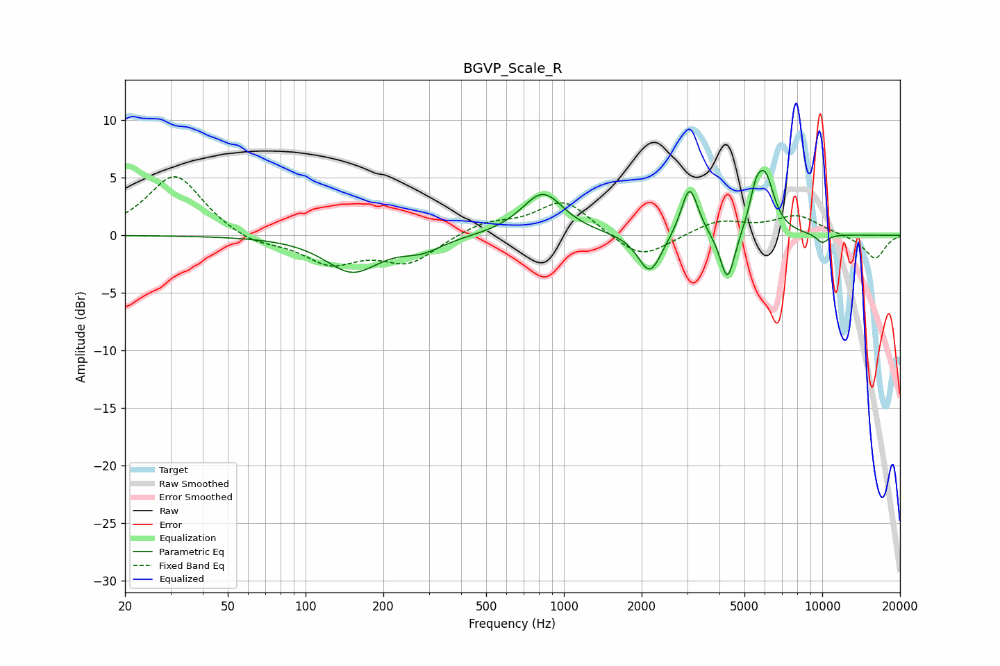

# BGVP_Scale_R
See [usage instructions](https://github.com/jaakkopasanen/AutoEq#usage) for more options and info.

### Parametric EQs
Apply preamp of -5.7 dB when using parametric equalizer.

|   # | Type    |   Fc (Hz) |    Q |   Gain (dB) |
|-----|---------|-----------|------|-------------|
|   1 | Peaking |       152 | 1.36 |        -3.1 |
|   2 | Peaking |       282 | 1.77 |        -1.1 |
|   3 | Peaking |       742 | 1.66 |         0.2 |
|   4 | Peaking |       832 | 1.79 |         3.5 |
|   5 | Peaking |      2152 | 3.11 |        -3.5 |
|   6 | Peaking |      3065 | 4.32 |         4.5 |
|   7 | Peaking |      4298 | 4.9  |        -4.5 |
|   8 | Peaking |      5524 | 5.87 |         2.3 |
|   9 | Peaking |      6019 | 3.87 |         4.8 |
|  10 | Peaking |     10000 | 5.21 |        -0.8 |

### Fixed Band EQs
When using fixed band (also called graphic) equalizer, apply preamp of **-5.2 dB** (if available) and set gains manually with these parameters.

|   # | Type    |   Fc (Hz) |    Q |   Gain (dB) |
|-----|---------|-----------|------|-------------|
|   1 | Peaking |        31 | 1.41 |         5.3 |
|   2 | Peaking |        62 | 1.41 |        -0.9 |
|   3 | Peaking |       125 | 1.41 |        -2.3 |
|   4 | Peaking |       250 | 1.41 |        -2.3 |
|   5 | Peaking |       500 | 1.41 |         1.1 |
|   6 | Peaking |      1000 | 1.41 |         3.1 |
|   7 | Peaking |      2000 | 1.41 |        -2.2 |
|   8 | Peaking |      4000 | 1.41 |         1.3 |
|   9 | Peaking |      8000 | 1.41 |         1.7 |
|  10 | Peaking |     16000 | 1.41 |        -2.1 |

### Graphs

