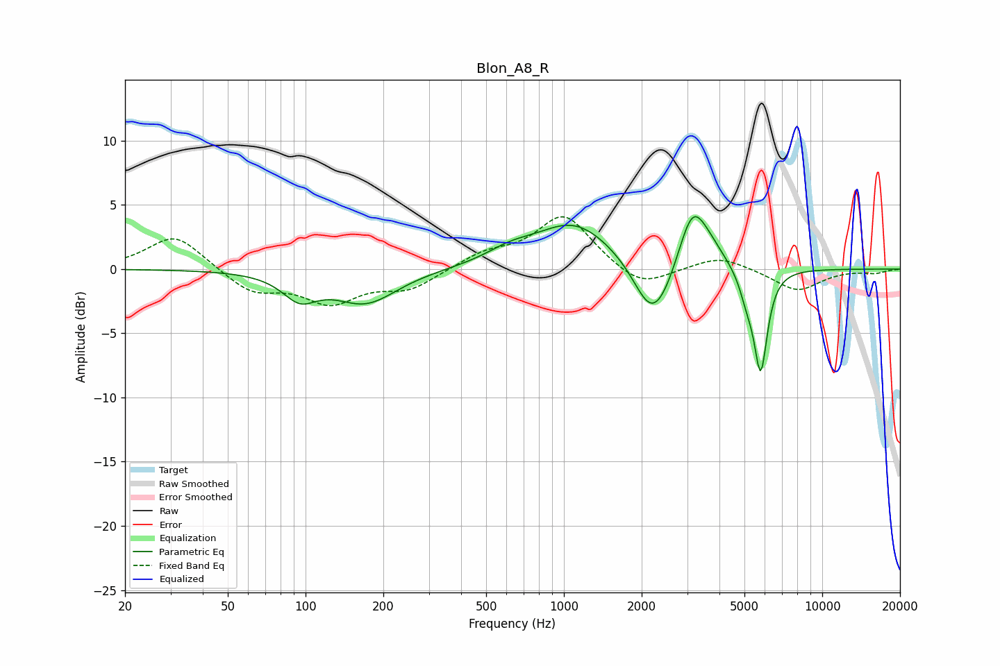

# Blon_A8_R
See [usage instructions](https://github.com/jaakkopasanen/AutoEq#usage) for more options and info.

### Parametric EQs
Apply preamp of -4.2 dB when using parametric equalizer.

|   # | Type    |   Fc (Hz) |    Q |   Gain (dB) |
|-----|---------|-----------|------|-------------|
|   1 | Peaking |        95 | 2.13 |        -1.9 |
|   2 | Peaking |       171 | 1.16 |        -2.6 |
|   3 | Peaking |       615 | 1.54 |         0.8 |
|   4 | Peaking |      1097 | 0.93 |         3.6 |
|   5 | Peaking |      2161 | 2.09 |        -3.7 |
|   6 | Peaking |      2427 | 2.16 |        -1.5 |
|   7 | Peaking |      3140 | 2.59 |         4.6 |
|   8 | Peaking |      3655 | 2.24 |         1.1 |
|   9 | Peaking |      5108 | 4.86 |        -1.7 |
|  10 | Peaking |      5778 | 5.31 |        -7.8 |

### Fixed Band EQs
When using fixed band (also called graphic) equalizer, apply preamp of **-4.2 dB** (if available) and set gains manually with these parameters.

|   # | Type    |   Fc (Hz) |    Q |   Gain (dB) |
|-----|---------|-----------|------|-------------|
|   1 | Peaking |        31 | 1.41 |         2.7 |
|   2 | Peaking |        62 | 1.41 |        -1.8 |
|   3 | Peaking |       125 | 1.41 |        -2.4 |
|   4 | Peaking |       250 | 1.41 |        -1.5 |
|   5 | Peaking |       500 | 1.41 |         1.1 |
|   6 | Peaking |      1000 | 1.41 |         4.2 |
|   7 | Peaking |      2000 | 1.41 |        -1.6 |
|   8 | Peaking |      4000 | 1.41 |         1.1 |
|   9 | Peaking |      8000 | 1.41 |        -1.7 |
|  10 | Peaking |     16000 | 1.41 |        -0.3 |

### Graphs

