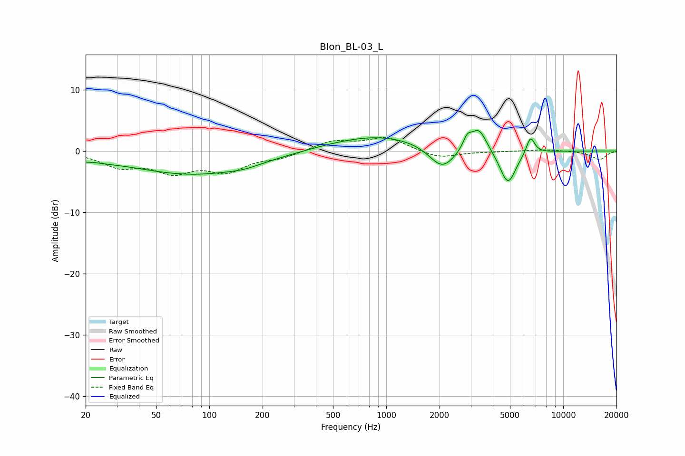

# Blon_BL-03_L
See [usage instructions](https://github.com/jaakkopasanen/AutoEq#usage) for more options and info.

### Parametric EQs
Apply preamp of -3.4 dB when using parametric equalizer.

|   # | Type    |   Fc (Hz) |    Q |   Gain (dB) |
|-----|---------|-----------|------|-------------|
|   1 | Peaking |        20 | 5.92 |        -0.3 |
|   2 | Peaking |        24 | 1.35 |        -0.5 |
|   3 | Peaking |        82 | 0.4  |        -3.8 |
|   4 | Peaking |       157 | 1.65 |        -0.4 |
|   5 | Peaking |       902 | 0.49 |         2.6 |
|   6 | Peaking |      2070 | 1.9  |        -3.9 |
|   7 | Peaking |      2869 | 5.93 |         1.9 |
|   8 | Peaking |      3332 | 3.13 |         3.8 |
|   9 | Peaking |      4867 | 3.02 |        -5.6 |
|  10 | Peaking |      6533 | 5.78 |         2.9 |

### Fixed Band EQs
When using fixed band (also called graphic) equalizer, apply preamp of **-2.3 dB** (if available) and set gains manually with these parameters.

|   # | Type    |   Fc (Hz) |    Q |   Gain (dB) |
|-----|---------|-----------|------|-------------|
|   1 | Peaking |        31 | 1.41 |        -2.3 |
|   2 | Peaking |        62 | 1.41 |        -3   |
|   3 | Peaking |       125 | 1.41 |        -3   |
|   4 | Peaking |       250 | 1.41 |        -1   |
|   5 | Peaking |       500 | 1.41 |         1.6 |
|   6 | Peaking |      1000 | 1.41 |         2.2 |
|   7 | Peaking |      2000 | 1.41 |        -1.2 |
|   8 | Peaking |      4000 | 1.41 |        -0.1 |
|   9 | Peaking |      8000 | 1.41 |         0.3 |
|  10 | Peaking |     16000 | 1.41 |        -1.4 |

### Graphs

