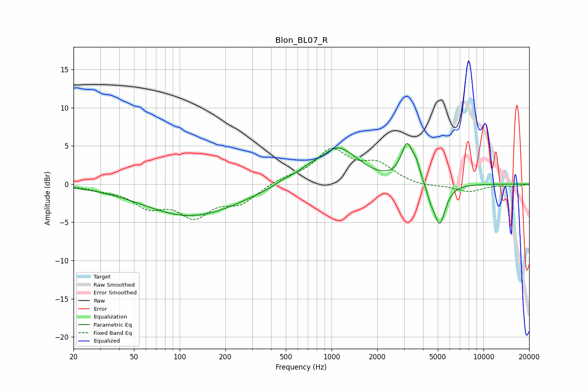

# Blon_BL07_R
See [usage instructions](https://github.com/jaakkopasanen/AutoEq#usage) for more options and info.

### Parametric EQs
Apply preamp of -5.4 dB when using parametric equalizer.

|   # | Type    |   Fc (Hz) |    Q |   Gain (dB) |
|-----|---------|-----------|------|-------------|
|   1 | Peaking |       114 | 0.47 |        -4.1 |
|   2 | Peaking |       223 | 0.91 |        -0.2 |
|   3 | Peaking |       480 | 2.48 |         0.4 |
|   4 | Peaking |       703 | 1.53 |         1.1 |
|   5 | Peaking |      1143 | 1.22 |         4.9 |
|   6 | Peaking |      1235 | 2.52 |        -0.5 |
|   7 | Peaking |      3141 | 3.61 |         4.8 |
|   8 | Peaking |      3616 | 5.79 |         1.5 |
|   9 | Peaking |      4484 | 5.99 |        -1.1 |
|  10 | Peaking |      5146 | 3.64 |        -5.4 |

### Fixed Band EQs
When using fixed band (also called graphic) equalizer, apply preamp of **-4.8 dB** (if available) and set gains manually with these parameters.

|   # | Type    |   Fc (Hz) |    Q |   Gain (dB) |
|-----|---------|-----------|------|-------------|
|   1 | Peaking |        31 | 1.41 |        -0.5 |
|   2 | Peaking |        62 | 1.41 |        -2.6 |
|   3 | Peaking |       125 | 1.41 |        -3.8 |
|   4 | Peaking |       250 | 1.41 |        -2.2 |
|   5 | Peaking |       500 | 1.41 |         0.7 |
|   6 | Peaking |      1000 | 1.41 |         4.2 |
|   7 | Peaking |      2000 | 1.41 |         2.4 |
|   8 | Peaking |      4000 | 1.41 |        -0.4 |
|   9 | Peaking |      8000 | 1.41 |        -1   |
|  10 | Peaking |     16000 | 1.41 |        -0.3 |

### Graphs

