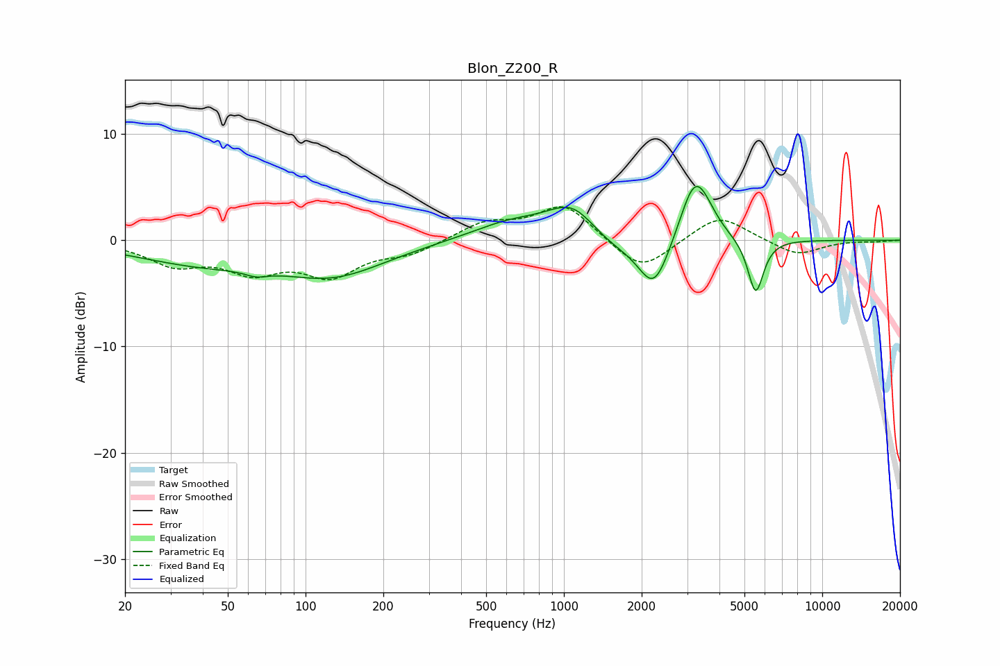

# Blon_Z200_R
See [usage instructions](https://github.com/jaakkopasanen/AutoEq#usage) for more options and info.

### Parametric EQs
Apply preamp of -5.2 dB when using parametric equalizer.

|   # | Type    |   Fc (Hz) |    Q |   Gain (dB) |
|-----|---------|-----------|------|-------------|
|   1 | Peaking |        40 | 0.53 |        -2   |
|   2 | Peaking |        65 | 3.37 |        -0.5 |
|   3 | Peaking |       129 | 0.7  |        -3   |
|   4 | Peaking |       625 | 0.91 |         1.7 |
|   5 | Peaking |      1088 | 1.44 |         3.4 |
|   6 | Peaking |      1467 | 1.16 |        -1.5 |
|   7 | Peaking |      2234 | 2.31 |        -4.9 |
|   8 | Peaking |      3186 | 2.48 |         5.3 |
|   9 | Peaking |      3478 | 2.72 |         1.3 |
|  10 | Peaking |      5526 | 4.53 |        -5.2 |

### Fixed Band EQs
When using fixed band (also called graphic) equalizer, apply preamp of **-3.2 dB** (if available) and set gains manually with these parameters.

|   # | Type    |   Fc (Hz) |    Q |   Gain (dB) |
|-----|---------|-----------|------|-------------|
|   1 | Peaking |        31 | 1.41 |        -2.1 |
|   2 | Peaking |        62 | 1.41 |        -2.6 |
|   3 | Peaking |       125 | 1.41 |        -3   |
|   4 | Peaking |       250 | 1.41 |        -1.1 |
|   5 | Peaking |       500 | 1.41 |         1.6 |
|   6 | Peaking |      1000 | 1.41 |         3.4 |
|   7 | Peaking |      2000 | 1.41 |        -3.1 |
|   8 | Peaking |      4000 | 1.41 |         2.5 |
|   9 | Peaking |      8000 | 1.41 |        -1.4 |
|  10 | Peaking |     16000 | 1.41 |        -0.1 |

### Graphs

