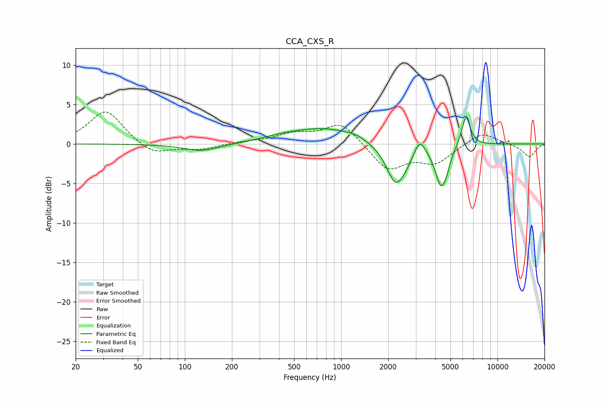

# CCA_CXS_R
See [usage instructions](https://github.com/jaakkopasanen/AutoEq#usage) for more options and info.

### Parametric EQs
Apply preamp of -3.4 dB when using parametric equalizer.

|   # | Type    |   Fc (Hz) |    Q |   Gain (dB) |
|-----|---------|-----------|------|-------------|
|   1 | Peaking |       128 | 1.23 |        -0.9 |
|   2 | Peaking |       423 | 0.98 |         0.5 |
|   3 | Peaking |       793 | 0.69 |         1.9 |
|   4 | Peaking |      1235 | 2.34 |         0.4 |
|   5 | Peaking |      2235 | 2.33 |        -5.1 |
|   6 | Peaking |      2592 | 3.9  |        -0.6 |
|   7 | Peaking |      3185 | 4.43 |         1.9 |
|   8 | Peaking |      4351 | 3.77 |        -4.9 |
|   9 | Peaking |      4733 | 6    |        -1.1 |
|  10 | Peaking |      6279 | 5.02 |         3.9 |

### Fixed Band EQs
When using fixed band (also called graphic) equalizer, apply preamp of **-4.1 dB** (if available) and set gains manually with these parameters.

|   # | Type    |   Fc (Hz) |    Q |   Gain (dB) |
|-----|---------|-----------|------|-------------|
|   1 | Peaking |        31 | 1.41 |         4.3 |
|   2 | Peaking |        62 | 1.41 |        -1.5 |
|   3 | Peaking |       125 | 1.41 |        -0.7 |
|   4 | Peaking |       250 | 1.41 |         0.2 |
|   5 | Peaking |       500 | 1.41 |         1.2 |
|   6 | Peaking |      1000 | 1.41 |         2.7 |
|   7 | Peaking |      2000 | 1.41 |        -3.3 |
|   8 | Peaking |      4000 | 1.41 |        -2.3 |
|   9 | Peaking |      8000 | 1.41 |         1.6 |
|  10 | Peaking |     16000 | 1.41 |        -1.6 |

### Graphs

