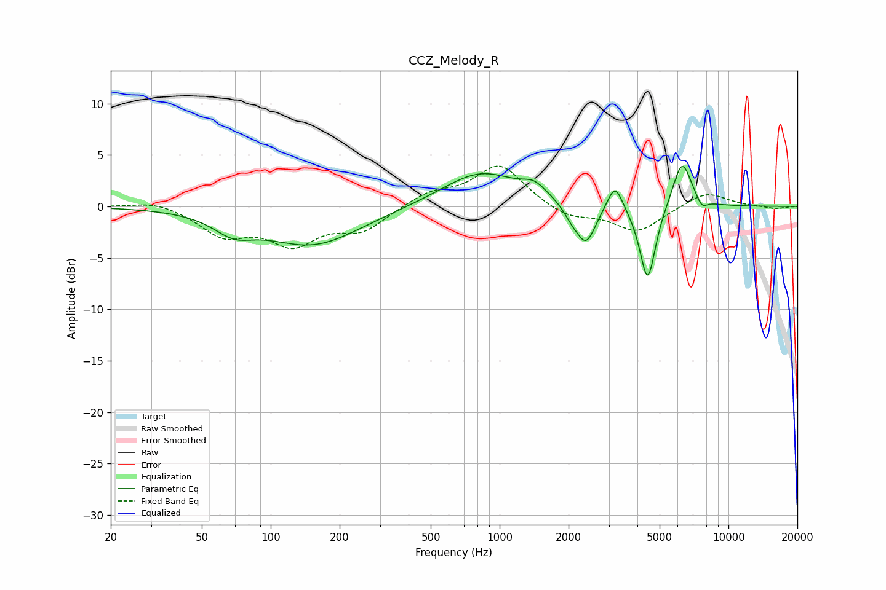

# CCZ_Melody_R
See [usage instructions](https://github.com/jaakkopasanen/AutoEq#usage) for more options and info.

### Parametric EQs
Apply preamp of -4.0 dB when using parametric equalizer.

|   # | Type    |   Fc (Hz) |    Q |   Gain (dB) |
|-----|---------|-----------|------|-------------|
|   1 | Peaking |        69 | 1.62 |        -1.7 |
|   2 | Peaking |       152 | 0.68 |        -3.7 |
|   3 | Peaking |       827 | 0.83 |         3.4 |
|   4 | Peaking |      1419 | 2.7  |         1.1 |
|   5 | Peaking |      2060 | 3.98 |        -0.9 |
|   6 | Peaking |      2385 | 3.29 |        -3.8 |
|   7 | Peaking |      3193 | 4.21 |         2.7 |
|   8 | Peaking |      4434 | 4.04 |        -7.6 |
|   9 | Peaking |      6267 | 3.32 |         4.7 |
|  10 | Peaking |      7652 | 5.88 |        -0.9 |

### Fixed Band EQs
When using fixed band (also called graphic) equalizer, apply preamp of **-4.0 dB** (if available) and set gains manually with these parameters.

|   # | Type    |   Fc (Hz) |    Q |   Gain (dB) |
|-----|---------|-----------|------|-------------|
|   1 | Peaking |        31 | 1.41 |         0.7 |
|   2 | Peaking |        62 | 1.41 |        -2.6 |
|   3 | Peaking |       125 | 1.41 |        -3.3 |
|   4 | Peaking |       250 | 1.41 |        -2.2 |
|   5 | Peaking |       500 | 1.41 |         1.3 |
|   6 | Peaking |      1000 | 1.41 |         4.1 |
|   7 | Peaking |      2000 | 1.41 |        -1.2 |
|   8 | Peaking |      4000 | 1.41 |        -2.5 |
|   9 | Peaking |      8000 | 1.41 |         1.5 |
|  10 | Peaking |     16000 | 1.41 |        -0.2 |

### Graphs

