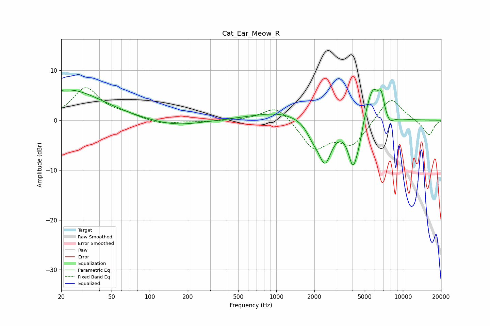

# Cat_Ear_Meow_R
See [usage instructions](https://github.com/jaakkopasanen/AutoEq#usage) for more options and info.

### Parametric EQs
Apply preamp of -6.3 dB when using parametric equalizer.

|   # | Type    |   Fc (Hz) |    Q |   Gain (dB) |
|-----|---------|-----------|------|-------------|
|   1 | Peaking |        23 | 0.52 |         6.1 |
|   2 | Peaking |       156 | 0.69 |        -1.3 |
|   3 | Peaking |      1102 | 0.61 |         1.7 |
|   4 | Peaking |      1938 | 2.83 |        -2   |
|   5 | Peaking |      2422 | 2.55 |        -8.3 |
|   6 | Peaking |      4047 | 3.47 |        -9.1 |
|   7 | Peaking |      4520 | 5.87 |        -1.9 |
|   8 | Peaking |      5777 | 2.53 |         7.1 |
|   9 | Peaking |      6754 | 5.85 |         3.3 |
|  10 | Peaking |      7829 | 3.84 |        -1.7 |

### Fixed Band EQs
When using fixed band (also called graphic) equalizer, apply preamp of **-6.6 dB** (if available) and set gains manually with these parameters.

|   # | Type    |   Fc (Hz) |    Q |   Gain (dB) |
|-----|---------|-----------|------|-------------|
|   1 | Peaking |        31 | 1.41 |         6.4 |
|   2 | Peaking |        62 | 1.41 |         0.9 |
|   3 | Peaking |       125 | 1.41 |        -0.9 |
|   4 | Peaking |       250 | 1.41 |        -0.3 |
|   5 | Peaking |       500 | 1.41 |        -0.1 |
|   6 | Peaking |      1000 | 1.41 |         3.2 |
|   7 | Peaking |      2000 | 1.41 |        -5.6 |
|   8 | Peaking |      4000 | 1.41 |        -4.7 |
|   9 | Peaking |      8000 | 1.41 |         4.9 |
|  10 | Peaking |     16000 | 1.41 |        -3.1 |

### Graphs

