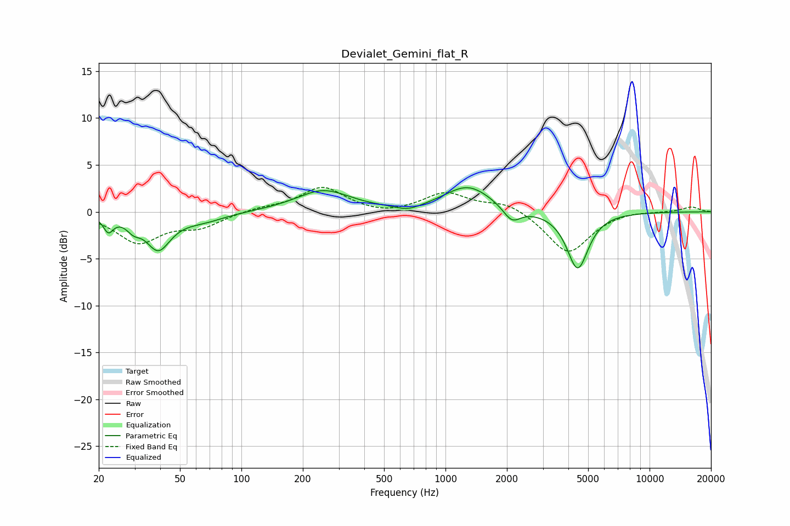

# Devialet_Gemini_flat_R
See [usage instructions](https://github.com/jaakkopasanen/AutoEq#usage) for more options and info.

### Parametric EQs
Apply preamp of -2.7 dB when using parametric equalizer.

|   # | Type    |   Fc (Hz) |    Q |   Gain (dB) |
|-----|---------|-----------|------|-------------|
|   1 | Peaking |        22 | 5.91 |        -1.6 |
|   2 | Peaking |        30 | 4.25 |        -1   |
|   3 | Peaking |        39 | 2.37 |        -4.3 |
|   4 | Peaking |        41 | 2.74 |         0.6 |
|   5 | Peaking |        65 | 1.31 |        -0.9 |
|   6 | Peaking |       252 | 1.08 |         2.3 |
|   7 | Peaking |       657 | 2.28 |        -0.6 |
|   8 | Peaking |      1291 | 1.22 |         2.7 |
|   9 | Peaking |      2116 | 3.31 |        -1.6 |
|  10 | Peaking |      4442 | 2.67 |        -6.1 |

### Fixed Band EQs
When using fixed band (also called graphic) equalizer, apply preamp of **-2.7 dB** (if available) and set gains manually with these parameters.

|   # | Type    |   Fc (Hz) |    Q |   Gain (dB) |
|-----|---------|-----------|------|-------------|
|   1 | Peaking |        31 | 1.41 |        -3.2 |
|   2 | Peaking |        62 | 1.41 |        -1.4 |
|   3 | Peaking |       125 | 1.41 |         0.4 |
|   4 | Peaking |       250 | 1.41 |         2.6 |
|   5 | Peaking |       500 | 1.41 |        -0.4 |
|   6 | Peaking |      1000 | 1.41 |         2   |
|   7 | Peaking |      2000 | 1.41 |         1.1 |
|   8 | Peaking |      4000 | 1.41 |        -4.5 |
|   9 | Peaking |      8000 | 1.41 |         0.2 |
|  10 | Peaking |     16000 | 1.41 |         0.5 |

### Graphs

