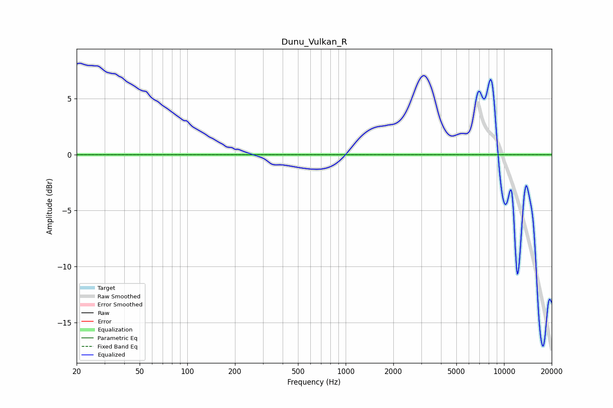

# Dunu_Vulkan_R
See [usage instructions](https://github.com/jaakkopasanen/AutoEq#usage) for more options and info.

### Parametric EQs
Apply preamp of -0.1 dB when using parametric equalizer.

|   # | Type    |   Fc (Hz) |    Q |   Gain (dB) |
|-----|---------|-----------|------|-------------|
|   1 | Peaking |       448 | 1.41 |          -0 |
|   2 | Peaking |       448 | 1.41 |          -0 |
|   3 | Peaking |       448 | 1.41 |          -0 |
|   4 | Peaking |       448 | 1.41 |          -0 |
|   5 | Peaking |       448 | 1.41 |          -0 |
|   6 | Peaking |       448 | 1.41 |          -0 |
|   7 | Peaking |       448 | 1.41 |          -0 |
|   8 | Peaking |       448 | 1.41 |          -0 |
|   9 | Peaking |       448 | 1.41 |          -0 |
|  10 | Peaking |       448 | 1.41 |          -0 |

### Fixed Band EQs
When using fixed band (also called graphic) equalizer, apply preamp of **-0.1 dB** (if available) and set gains manually with these parameters.

|   # | Type    |   Fc (Hz) |    Q |   Gain (dB) |
|-----|---------|-----------|------|-------------|
|   1 | Peaking |        31 | 1.41 |          -0 |
|   2 | Peaking |        62 | 1.41 |          -0 |
|   3 | Peaking |       125 | 1.41 |          -0 |
|   4 | Peaking |       250 | 1.41 |          -0 |
|   5 | Peaking |       500 | 1.41 |          -0 |
|   6 | Peaking |      1000 | 1.41 |          -0 |
|   7 | Peaking |      2000 | 1.41 |          -0 |
|   8 | Peaking |      4000 | 1.41 |          -0 |
|   9 | Peaking |      8000 | 1.41 |          -0 |
|  10 | Peaking |     16000 | 1.41 |          -0 |

### Graphs

