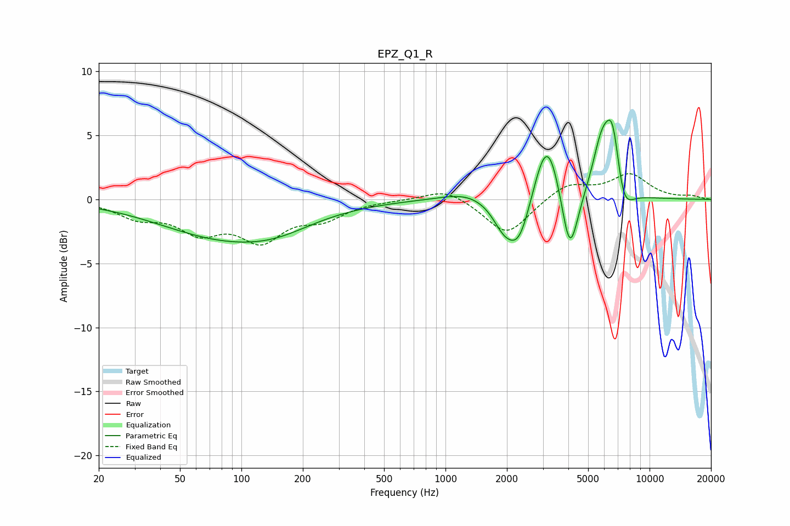

# EPZ_Q1_R
See [usage instructions](https://github.com/jaakkopasanen/AutoEq#usage) for more options and info.

### Parametric EQs
Apply preamp of -6.3 dB when using parametric equalizer.

|   # | Type    |   Fc (Hz) |    Q |   Gain (dB) |
|-----|---------|-----------|------|-------------|
|   1 | Peaking |        85 | 0.43 |        -2.9 |
|   2 | Peaking |       148 | 0.82 |        -0.7 |
|   3 | Peaking |      1270 | 1.17 |         0.7 |
|   4 | Peaking |      1920 | 2.57 |        -1.7 |
|   5 | Peaking |      2295 | 2.32 |        -3.8 |
|   6 | Peaking |      3147 | 2.17 |         5.7 |
|   7 | Peaking |      4065 | 3.36 |        -5.7 |
|   8 | Peaking |      5820 | 3    |         3.8 |
|   9 | Peaking |      6606 | 3.57 |         5.4 |
|  10 | Peaking |      7379 | 3.02 |        -2.8 |

### Fixed Band EQs
When using fixed band (also called graphic) equalizer, apply preamp of **-2.1 dB** (if available) and set gains manually with these parameters.

|   # | Type    |   Fc (Hz) |    Q |   Gain (dB) |
|-----|---------|-----------|------|-------------|
|   1 | Peaking |        31 | 1.41 |        -1.2 |
|   2 | Peaking |        62 | 1.41 |        -2.2 |
|   3 | Peaking |       125 | 1.41 |        -2.9 |
|   4 | Peaking |       250 | 1.41 |        -1.3 |
|   5 | Peaking |       500 | 1.41 |        -0   |
|   6 | Peaking |      1000 | 1.41 |         0.9 |
|   7 | Peaking |      2000 | 1.41 |        -2.8 |
|   8 | Peaking |      4000 | 1.41 |         1.3 |
|   9 | Peaking |      8000 | 1.41 |         1.9 |
|  10 | Peaking |     16000 | 1.41 |         0.2 |

### Graphs

