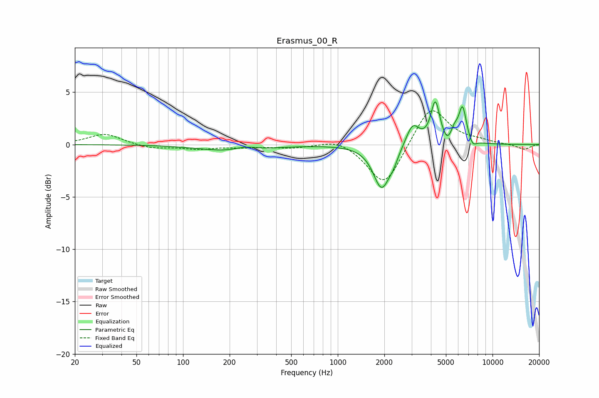

# Erasmus_00_R
See [usage instructions](https://github.com/jaakkopasanen/AutoEq#usage) for more options and info.

### Parametric EQs
Apply preamp of -4.2 dB when using parametric equalizer.

|   # | Type    |   Fc (Hz) |    Q |   Gain (dB) |
|-----|---------|-----------|------|-------------|
|   1 | Peaking |       215 | 0.71 |        -0.7 |
|   2 | Peaking |       251 | 1.93 |         0.4 |
|   3 | Peaking |      1921 | 2.63 |        -4.1 |
|   4 | Peaking |      2294 | 4.65 |        -0.7 |
|   5 | Peaking |      3048 | 3.28 |         2.1 |
|   6 | Peaking |      4271 | 4.9  |         3.9 |
|   7 | Peaking |      5088 | 5.55 |        -0.7 |
|   8 | Peaking |      5688 | 5.98 |         0.9 |
|   9 | Peaking |      6404 | 5.54 |         3.4 |
|  10 | Peaking |      7455 | 6    |        -0.7 |

### Fixed Band EQs
When using fixed band (also called graphic) equalizer, apply preamp of **-3.3 dB** (if available) and set gains manually with these parameters.

|   # | Type    |   Fc (Hz) |    Q |   Gain (dB) |
|-----|---------|-----------|------|-------------|
|   1 | Peaking |        31 | 1.41 |         1   |
|   2 | Peaking |        62 | 1.41 |        -0.4 |
|   3 | Peaking |       125 | 1.41 |        -0.4 |
|   4 | Peaking |       250 | 1.41 |        -0.2 |
|   5 | Peaking |       500 | 1.41 |        -0.3 |
|   6 | Peaking |      1000 | 1.41 |         0.6 |
|   7 | Peaking |      2000 | 1.41 |        -4.1 |
|   8 | Peaking |      4000 | 1.41 |         3.9 |
|   9 | Peaking |      8000 | 1.41 |         0.3 |
|  10 | Peaking |     16000 | 1.41 |        -0.5 |

### Graphs

