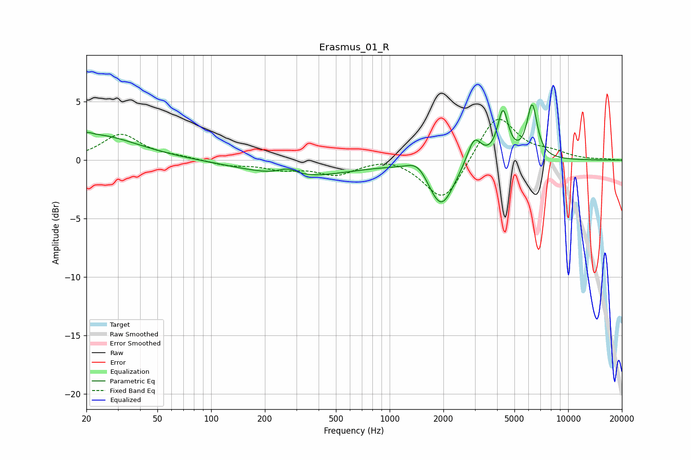

# Erasmus_01_R
See [usage instructions](https://github.com/jaakkopasanen/AutoEq#usage) for more options and info.

### Parametric EQs
Apply preamp of -4.8 dB when using parametric equalizer.

|   # | Type    |   Fc (Hz) |    Q |   Gain (dB) |
|-----|---------|-----------|------|-------------|
|   1 | Peaking |        20 | 5.93 |         0.2 |
|   2 | Peaking |        22 | 0.6  |         2.2 |
|   3 | Peaking |       267 | 2.68 |         0.6 |
|   4 | Peaking |       310 | 0.5  |        -1.4 |
|   5 | Peaking |      1444 | 2.43 |         1.1 |
|   6 | Peaking |      1941 | 1.96 |        -4.1 |
|   7 | Peaking |      2978 | 3.48 |         2.3 |
|   8 | Peaking |      4314 | 4.68 |         4   |
|   9 | Peaking |      6278 | 4.77 |         3.9 |
|  10 | Peaking |      6307 | 5.18 |         0.7 |

### Fixed Band EQs
When using fixed band (also called graphic) equalizer, apply preamp of **-3.6 dB** (if available) and set gains manually with these parameters.

|   # | Type    |   Fc (Hz) |    Q |   Gain (dB) |
|-----|---------|-----------|------|-------------|
|   1 | Peaking |        31 | 1.41 |         2.2 |
|   2 | Peaking |        62 | 1.41 |         0.2 |
|   3 | Peaking |       125 | 1.41 |        -0.4 |
|   4 | Peaking |       250 | 1.41 |        -0.7 |
|   5 | Peaking |       500 | 1.41 |        -1.2 |
|   6 | Peaking |      1000 | 1.41 |         0.4 |
|   7 | Peaking |      2000 | 1.41 |        -3.7 |
|   8 | Peaking |      4000 | 1.41 |         4   |
|   9 | Peaking |      8000 | 1.41 |         0.5 |
|  10 | Peaking |     16000 | 1.41 |         0.1 |

### Graphs

