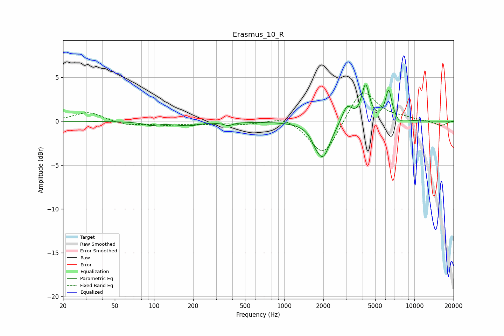

# Erasmus_10_R
See [usage instructions](https://github.com/jaakkopasanen/AutoEq#usage) for more options and info.

### Parametric EQs
Apply preamp of -4.3 dB when using parametric equalizer.

|   # | Type    |   Fc (Hz) |    Q |   Gain (dB) |
|-----|---------|-----------|------|-------------|
|   1 | Peaking |        94 | 2.73 |        -0.3 |
|   2 | Peaking |       203 | 0.96 |        -0.6 |
|   3 | Peaking |       253 | 1.95 |         0.3 |
|   4 | Peaking |       374 | 4.97 |        -0.3 |
|   5 | Peaking |      1732 | 4.8  |        -0.5 |
|   6 | Peaking |      1984 | 2.51 |        -4.1 |
|   7 | Peaking |      3037 | 3.62 |         2   |
|   8 | Peaking |      4216 | 4.78 |         4   |
|   9 | Peaking |      6338 | 5.56 |         3.4 |
|  10 | Peaking |      7633 | 6    |        -0.4 |

### Fixed Band EQs
When using fixed band (also called graphic) equalizer, apply preamp of **-3.3 dB** (if available) and set gains manually with these parameters.

|   # | Type    |   Fc (Hz) |    Q |   Gain (dB) |
|-----|---------|-----------|------|-------------|
|   1 | Peaking |        31 | 1.41 |         1.1 |
|   2 | Peaking |        62 | 1.41 |        -0.5 |
|   3 | Peaking |       125 | 1.41 |        -0.4 |
|   4 | Peaking |       250 | 1.41 |        -0.2 |
|   5 | Peaking |       500 | 1.41 |        -0.3 |
|   6 | Peaking |      1000 | 1.41 |         0.7 |
|   7 | Peaking |      2000 | 1.41 |        -4.1 |
|   8 | Peaking |      4000 | 1.41 |         3.9 |
|   9 | Peaking |      8000 | 1.41 |         0.3 |
|  10 | Peaking |     16000 | 1.41 |        -0.5 |

### Graphs

