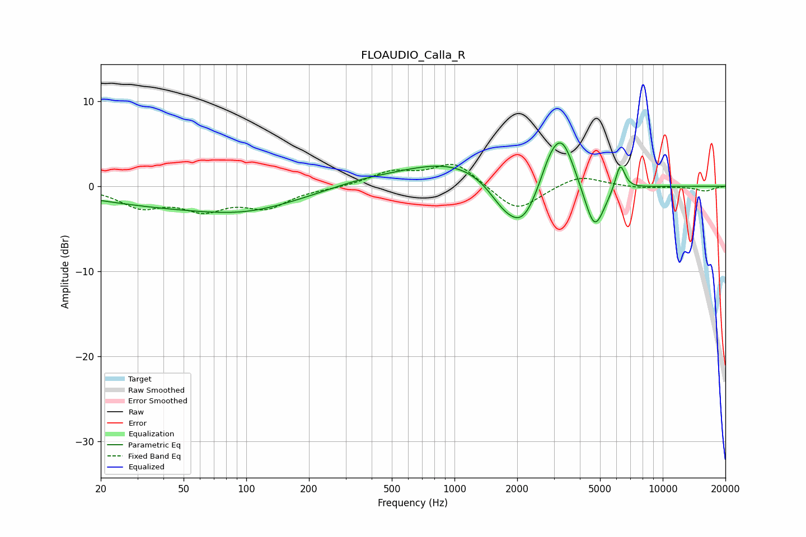

# FLOAUDIO_Calla_R
See [usage instructions](https://github.com/jaakkopasanen/AutoEq#usage) for more options and info.

### Parametric EQs
Apply preamp of -5.2 dB when using parametric equalizer.

|   # | Type    |   Fc (Hz) |    Q |   Gain (dB) |
|-----|---------|-----------|------|-------------|
|   1 | Peaking |        58 | 0.28 |        -2.5 |
|   2 | Peaking |       100 | 0.69 |        -0.9 |
|   3 | Peaking |       345 | 0.85 |         0.6 |
|   4 | Peaking |      1001 | 0.55 |         3   |
|   5 | Peaking |      1695 | 1.87 |        -1.9 |
|   6 | Peaking |      2122 | 1.64 |        -5.5 |
|   7 | Peaking |      2851 | 2.8  |         2   |
|   8 | Peaking |      3279 | 2.24 |         5.9 |
|   9 | Peaking |      4703 | 2.81 |        -5.9 |
|  10 | Peaking |      6247 | 5.96 |         3.2 |

### Fixed Band EQs
When using fixed band (also called graphic) equalizer, apply preamp of **-2.7 dB** (if available) and set gains manually with these parameters.

|   # | Type    |   Fc (Hz) |    Q |   Gain (dB) |
|-----|---------|-----------|------|-------------|
|   1 | Peaking |        31 | 1.41 |        -2.2 |
|   2 | Peaking |        62 | 1.41 |        -2.4 |
|   3 | Peaking |       125 | 1.41 |        -2.3 |
|   4 | Peaking |       250 | 1.41 |        -0.2 |
|   5 | Peaking |       500 | 1.41 |         1.6 |
|   6 | Peaking |      1000 | 1.41 |         2.8 |
|   7 | Peaking |      2000 | 1.41 |        -3.1 |
|   8 | Peaking |      4000 | 1.41 |         1.4 |
|   9 | Peaking |      8000 | 1.41 |        -0.2 |
|  10 | Peaking |     16000 | 1.41 |        -0.5 |

### Graphs

