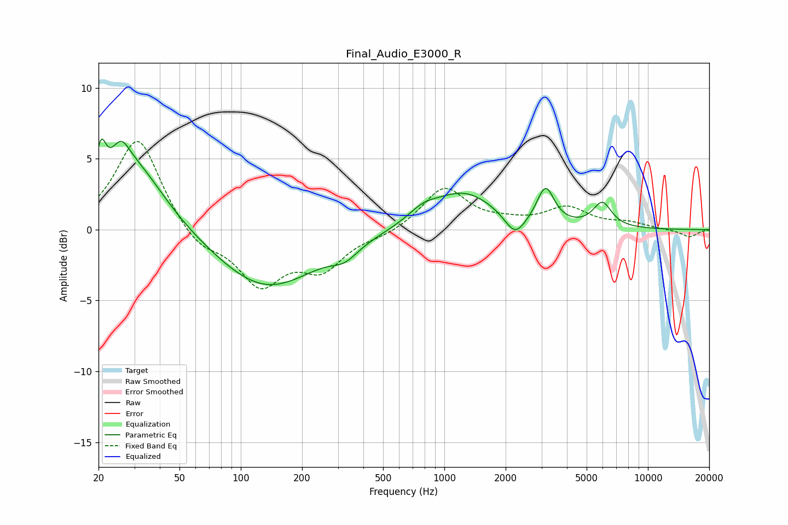

# Final_Audio_E3000_R
See [usage instructions](https://github.com/jaakkopasanen/AutoEq#usage) for more options and info.

### Parametric EQs
Apply preamp of -6.5 dB when using parametric equalizer.

|   # | Type    |   Fc (Hz) |    Q |   Gain (dB) |
|-----|---------|-----------|------|-------------|
|   1 | Peaking |        21 | 5.66 |         2.9 |
|   2 | Peaking |        26 | 3.23 |         2   |
|   3 | Peaking |        30 | 0.92 |         4.6 |
|   4 | Peaking |       133 | 0.58 |        -4.2 |
|   5 | Peaking |       325 | 2.16 |        -0.9 |
|   6 | Peaking |       785 | 1.91 |         0.8 |
|   7 | Peaking |      1247 | 0.9  |         2.6 |
|   8 | Peaking |      2227 | 2.8  |        -1.6 |
|   9 | Peaking |      3143 | 3.36 |         2.6 |
|  10 | Peaking |      5969 | 3.02 |         1.7 |

### Fixed Band EQs
When using fixed band (also called graphic) equalizer, apply preamp of **-6.3 dB** (if available) and set gains manually with these parameters.

|   # | Type    |   Fc (Hz) |    Q |   Gain (dB) |
|-----|---------|-----------|------|-------------|
|   1 | Peaking |        31 | 1.41 |         6.6 |
|   2 | Peaking |        62 | 1.41 |        -1.4 |
|   3 | Peaking |       125 | 1.41 |        -3.7 |
|   4 | Peaking |       250 | 1.41 |        -2.5 |
|   5 | Peaking |       500 | 1.41 |        -0.4 |
|   6 | Peaking |      1000 | 1.41 |         3   |
|   7 | Peaking |      2000 | 1.41 |         0.4 |
|   8 | Peaking |      4000 | 1.41 |         1.5 |
|   9 | Peaking |      8000 | 1.41 |         0.4 |
|  10 | Peaking |     16000 | 1.41 |        -0.5 |

### Graphs

