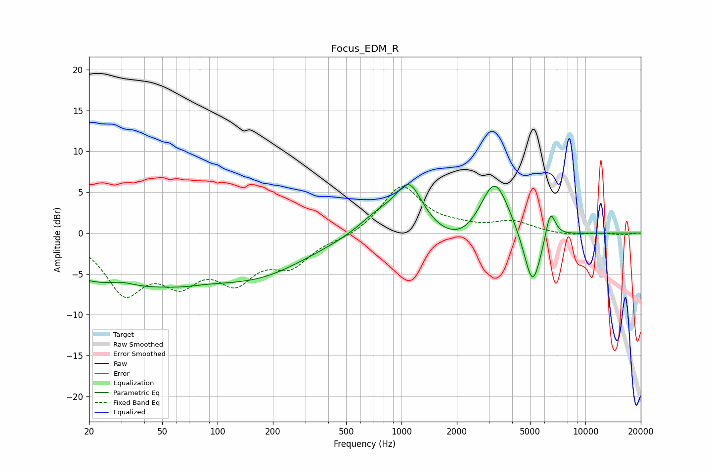

# Focus_EDM_R
See [usage instructions](https://github.com/jaakkopasanen/AutoEq#usage) for more options and info.

### Parametric EQs
Apply preamp of -6.0 dB when using parametric equalizer.

|   # | Type    |   Fc (Hz) |    Q |   Gain (dB) |
|-----|---------|-----------|------|-------------|
|   1 | Peaking |        30 | 0.31 |        -6.2 |
|   2 | Peaking |        31 | 2    |         0.6 |
|   3 | Peaking |        65 | 1.96 |        -0.2 |
|   4 | Peaking |       175 | 0.51 |        -3.9 |
|   5 | Peaking |       748 | 1.25 |         2.2 |
|   6 | Peaking |      1103 | 1.91 |         5.6 |
|   7 | Peaking |      2169 | 0.98 |        -2.5 |
|   8 | Peaking |      3204 | 1.69 |         7.7 |
|   9 | Peaking |      5160 | 2.84 |        -7.4 |
|  10 | Peaking |      6448 | 4.91 |         3.8 |

### Fixed Band EQs
When using fixed band (also called graphic) equalizer, apply preamp of **-5.8 dB** (if available) and set gains manually with these parameters.

|   # | Type    |   Fc (Hz) |    Q |   Gain (dB) |
|-----|---------|-----------|------|-------------|
|   1 | Peaking |        31 | 1.41 |        -6.8 |
|   2 | Peaking |        62 | 1.41 |        -4.8 |
|   3 | Peaking |       125 | 1.41 |        -5   |
|   4 | Peaking |       250 | 1.41 |        -3.5 |
|   5 | Peaking |       500 | 1.41 |        -0.6 |
|   6 | Peaking |      1000 | 1.41 |         5.8 |
|   7 | Peaking |      2000 | 1.41 |         0.5 |
|   8 | Peaking |      4000 | 1.41 |         1.3 |
|   9 | Peaking |      8000 | 1.41 |        -0.3 |
|  10 | Peaking |     16000 | 1.41 |        -0.2 |

### Graphs

