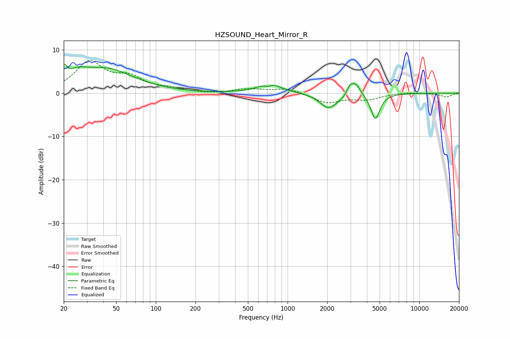

# HZSOUND_Heart_Mirror_R
See [usage instructions](https://github.com/jaakkopasanen/AutoEq#usage) for more options and info.

### Parametric EQs
Apply preamp of -6.8 dB when using parametric equalizer.

|   # | Type    |   Fc (Hz) |    Q |   Gain (dB) |
|-----|---------|-----------|------|-------------|
|   1 | Peaking |        20 | 5.98 |         3.1 |
|   2 | Peaking |        26 | 1.88 |         2.1 |
|   3 | Peaking |        42 | 0.68 |         5.4 |
|   4 | Peaking |       708 | 5.99 |        -0.6 |
|   5 | Peaking |       728 | 1.7  |         2.3 |
|   6 | Peaking |      2028 | 2.32 |        -3.1 |
|   7 | Peaking |      2508 | 1.7  |        -0.7 |
|   8 | Peaking |      2975 | 5.96 |         1.9 |
|   9 | Peaking |      3298 | 4.02 |         2.7 |
|  10 | Peaking |      4639 | 4.08 |        -5.9 |

### Fixed Band EQs
When using fixed band (also called graphic) equalizer, apply preamp of **-7.6 dB** (if available) and set gains manually with these parameters.

|   # | Type    |   Fc (Hz) |    Q |   Gain (dB) |
|-----|---------|-----------|------|-------------|
|   1 | Peaking |        31 | 1.41 |         6.9 |
|   2 | Peaking |        62 | 1.41 |         3.1 |
|   3 | Peaking |       125 | 1.41 |         0.8 |
|   4 | Peaking |       250 | 1.41 |        -0.2 |
|   5 | Peaking |       500 | 1.41 |         0.9 |
|   6 | Peaking |      1000 | 1.41 |         1.1 |
|   7 | Peaking |      2000 | 1.41 |        -2.2 |
|   8 | Peaking |      4000 | 1.41 |        -1.3 |
|   9 | Peaking |      8000 | 1.41 |         0.3 |
|  10 | Peaking |     16000 | 1.41 |        -0.9 |

### Graphs

