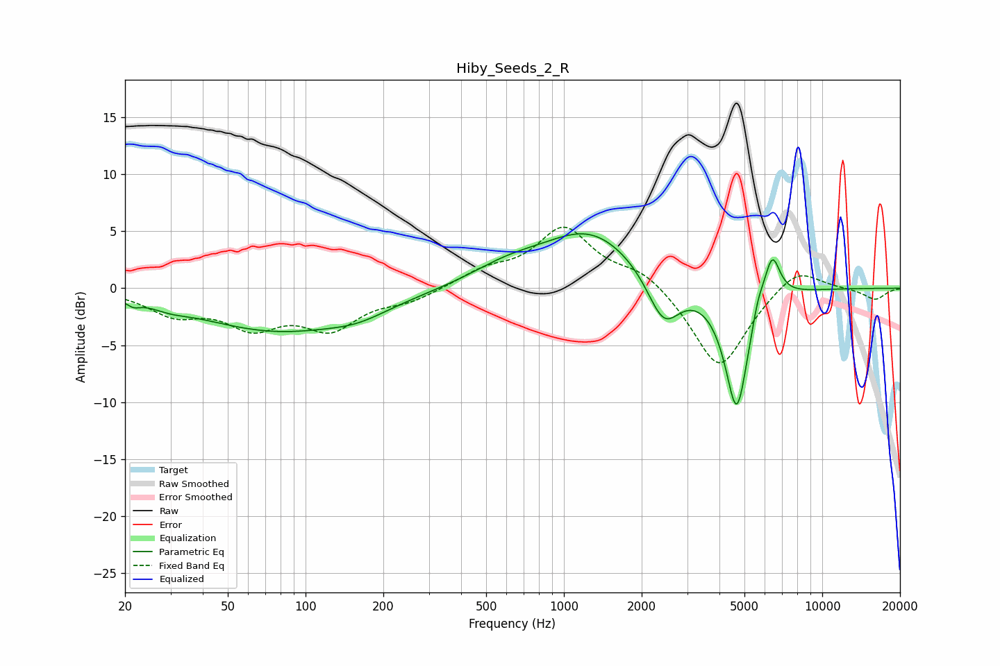

# Hiby_Seeds_2_R
See [usage instructions](https://github.com/jaakkopasanen/AutoEq#usage) for more options and info.

### Parametric EQs
Apply preamp of -4.9 dB when using parametric equalizer.

|   # | Type    |   Fc (Hz) |    Q |   Gain (dB) |
|-----|---------|-----------|------|-------------|
|   1 | Peaking |        22 | 5.96 |        -0.4 |
|   2 | Peaking |        30 | 2.24 |        -0.4 |
|   3 | Peaking |        78 | 0.45 |        -3.7 |
|   4 | Peaking |       160 | 1.21 |        -0.8 |
|   5 | Peaking |       599 | 1    |         1.3 |
|   6 | Peaking |      1271 | 0.74 |         4.9 |
|   7 | Peaking |      2433 | 2.2  |        -4.4 |
|   8 | Peaking |      4667 | 2.98 |       -11.1 |
|   9 | Peaking |      5640 | 6    |         1.5 |
|  10 | Peaking |      6394 | 4.36 |         4.2 |

### Fixed Band EQs
When using fixed band (also called graphic) equalizer, apply preamp of **-5.4 dB** (if available) and set gains manually with these parameters.

|   # | Type    |   Fc (Hz) |    Q |   Gain (dB) |
|-----|---------|-----------|------|-------------|
|   1 | Peaking |        31 | 1.41 |        -2   |
|   2 | Peaking |        62 | 1.41 |        -3   |
|   3 | Peaking |       125 | 1.41 |        -3.2 |
|   4 | Peaking |       250 | 1.41 |        -1   |
|   5 | Peaking |       500 | 1.41 |         1.3 |
|   6 | Peaking |      1000 | 1.41 |         5.1 |
|   7 | Peaking |      2000 | 1.41 |         1.6 |
|   8 | Peaking |      4000 | 1.41 |        -7.3 |
|   9 | Peaking |      8000 | 1.41 |         2.1 |
|  10 | Peaking |     16000 | 1.41 |        -1   |

### Graphs

