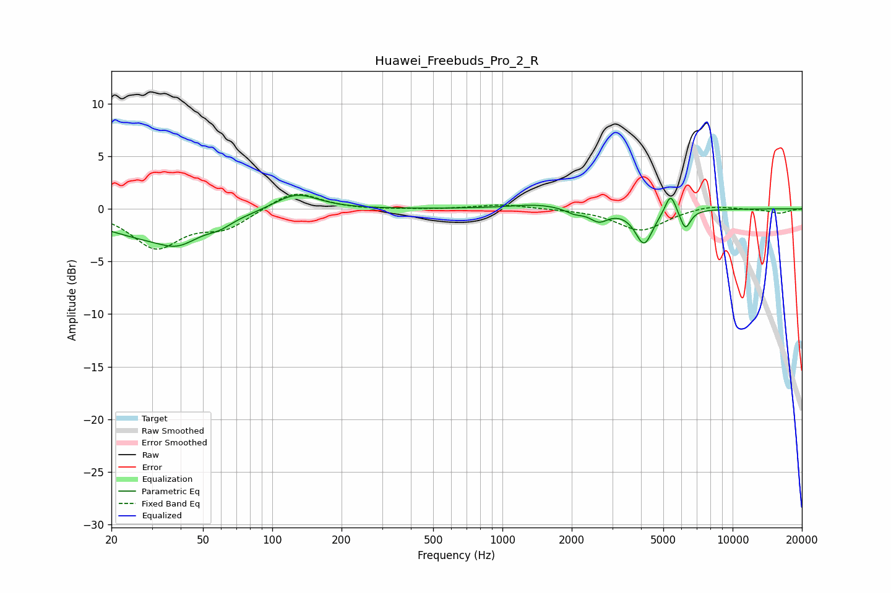

# Huawei_Freebuds_Pro_2_R
See [usage instructions](https://github.com/jaakkopasanen/AutoEq#usage) for more options and info.

### Parametric EQs
Apply preamp of -1.4 dB when using parametric equalizer.

|   # | Type    |   Fc (Hz) |    Q |   Gain (dB) |
|-----|---------|-----------|------|-------------|
|   1 | Peaking |        30 | 0.63 |        -2.5 |
|   2 | Peaking |        39 | 1.78 |        -1.3 |
|   3 | Peaking |        59 | 2.76 |        -0.6 |
|   4 | Peaking |       127 | 1.45 |         1.7 |
|   5 | Peaking |      1443 | 1.13 |         0.5 |
|   6 | Peaking |      2052 | 3.52 |        -0.5 |
|   7 | Peaking |      2625 | 3.6  |        -1.1 |
|   8 | Peaking |      4125 | 3.72 |        -3.3 |
|   9 | Peaking |      5377 | 5.93 |         2   |
|  10 | Peaking |      6229 | 6    |        -1.9 |

### Fixed Band EQs
When using fixed band (also called graphic) equalizer, apply preamp of **-1.5 dB** (if available) and set gains manually with these parameters.

|   # | Type    |   Fc (Hz) |    Q |   Gain (dB) |
|-----|---------|-----------|------|-------------|
|   1 | Peaking |        31 | 1.41 |        -3.6 |
|   2 | Peaking |        62 | 1.41 |        -1.7 |
|   3 | Peaking |       125 | 1.41 |         1.8 |
|   4 | Peaking |       250 | 1.41 |        -0.1 |
|   5 | Peaking |       500 | 1.41 |        -0   |
|   6 | Peaking |      1000 | 1.41 |         0.4 |
|   7 | Peaking |      2000 | 1.41 |        -0   |
|   8 | Peaking |      4000 | 1.41 |        -2.1 |
|   9 | Peaking |      8000 | 1.41 |         0.4 |
|  10 | Peaking |     16000 | 1.41 |        -0.4 |

### Graphs

