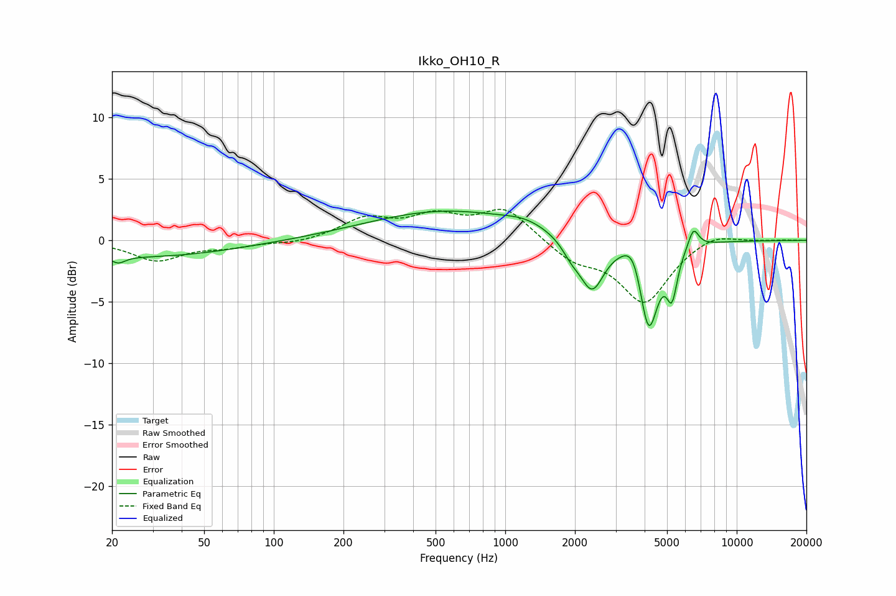

# Ikko_OH10_R
See [usage instructions](https://github.com/jaakkopasanen/AutoEq#usage) for more options and info.

### Parametric EQs
Apply preamp of -2.5 dB when using parametric equalizer.

|   # | Type    |   Fc (Hz) |    Q |   Gain (dB) |
|-----|---------|-----------|------|-------------|
|   1 | Peaking |        21 | 4.68 |        -0.6 |
|   2 | Peaking |        28 | 0.38 |        -1.3 |
|   3 | Peaking |       556 | 0.42 |         2.4 |
|   4 | Peaking |      1223 | 1.59 |         0.5 |
|   5 | Peaking |      1933 | 3.39 |        -1.1 |
|   6 | Peaking |      2372 | 2.69 |        -4.1 |
|   7 | Peaking |      3601 | 3.3  |         2   |
|   8 | Peaking |      4159 | 3.41 |        -7.5 |
|   9 | Peaking |      5252 | 6    |        -3.5 |
|  10 | Peaking |      6501 | 6    |         1.6 |

### Fixed Band EQs
When using fixed band (also called graphic) equalizer, apply preamp of **-2.6 dB** (if available) and set gains manually with these parameters.

|   # | Type    |   Fc (Hz) |    Q |   Gain (dB) |
|-----|---------|-----------|------|-------------|
|   1 | Peaking |        31 | 1.41 |        -1.6 |
|   2 | Peaking |        62 | 1.41 |        -0.5 |
|   3 | Peaking |       125 | 1.41 |        -0.3 |
|   4 | Peaking |       250 | 1.41 |         1.7 |
|   5 | Peaking |       500 | 1.41 |         1.7 |
|   6 | Peaking |      1000 | 1.41 |         2.5 |
|   7 | Peaking |      2000 | 1.41 |        -1.5 |
|   8 | Peaking |      4000 | 1.41 |        -5   |
|   9 | Peaking |      8000 | 1.41 |         0.8 |
|  10 | Peaking |     16000 | 1.41 |         0   |

### Graphs

