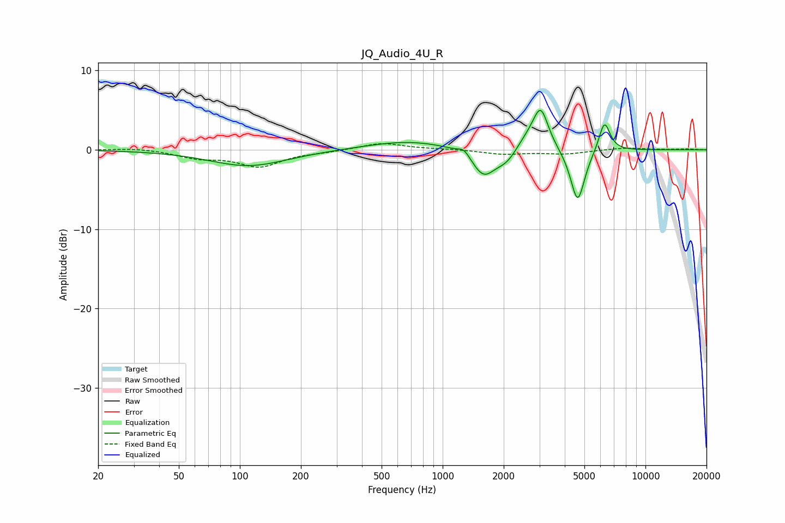

# JQ_Audio_4U_R
See [usage instructions](https://github.com/jaakkopasanen/AutoEq#usage) for more options and info.

### Parametric EQs
Apply preamp of -5.1 dB when using parametric equalizer.

|   # | Type    |   Fc (Hz) |    Q |   Gain (dB) |
|-----|---------|-----------|------|-------------|
|   1 | Peaking |       110 | 0.74 |        -2   |
|   2 | Peaking |       675 | 0.69 |         1.1 |
|   3 | Peaking |      1272 | 5.26 |         0.8 |
|   4 | Peaking |      1590 | 2.5  |        -3.3 |
|   5 | Peaking |      2010 | 2.41 |        -1   |
|   6 | Peaking |      2105 | 3.26 |        -0.6 |
|   7 | Peaking |      2619 | 2.36 |         1.3 |
|   8 | Peaking |      3044 | 3.67 |         5   |
|   9 | Peaking |      4630 | 3.96 |        -6.8 |
|  10 | Peaking |      6278 | 4.93 |         3.9 |

### Fixed Band EQs
When using fixed band (also called graphic) equalizer, apply preamp of **-0.9 dB** (if available) and set gains manually with these parameters.

|   # | Type    |   Fc (Hz) |    Q |   Gain (dB) |
|-----|---------|-----------|------|-------------|
|   1 | Peaking |        31 | 1.41 |         0.2 |
|   2 | Peaking |        62 | 1.41 |        -0.9 |
|   3 | Peaking |       125 | 1.41 |        -2   |
|   4 | Peaking |       250 | 1.41 |        -0.2 |
|   5 | Peaking |       500 | 1.41 |         0.9 |
|   6 | Peaking |      1000 | 1.41 |         0.1 |
|   7 | Peaking |      2000 | 1.41 |        -0.5 |
|   8 | Peaking |      4000 | 1.41 |        -0.5 |
|   9 | Peaking |      8000 | 1.41 |         0.3 |
|  10 | Peaking |     16000 | 1.41 |         0.1 |

### Graphs

