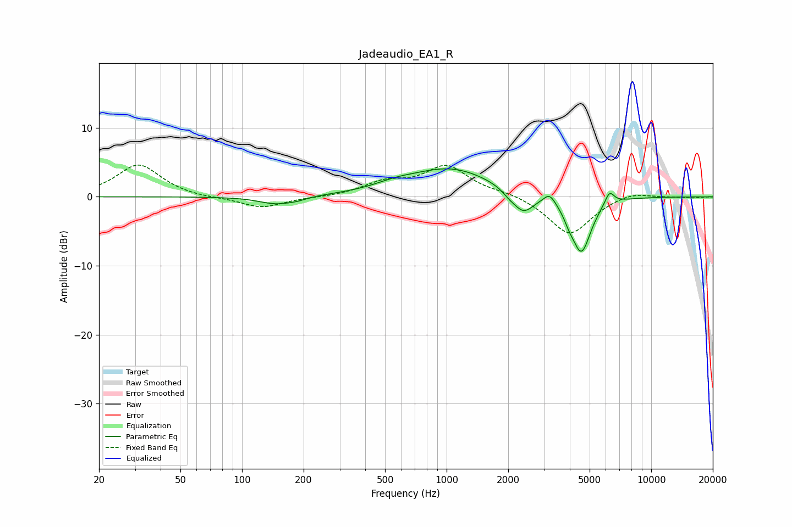

# Jadeaudio_EA1_R
See [usage instructions](https://github.com/jaakkopasanen/AutoEq#usage) for more options and info.

### Parametric EQs
Apply preamp of -4.1 dB when using parametric equalizer.

|   # | Type    |   Fc (Hz) |    Q |   Gain (dB) |
|-----|---------|-----------|------|-------------|
|   1 | Peaking |       146 | 1.68 |        -1.1 |
|   2 | Peaking |       185 | 2.91 |        -0.3 |
|   3 | Peaking |       559 | 1.44 |         0.7 |
|   4 | Peaking |      1049 | 0.69 |         4.1 |
|   5 | Peaking |      2019 | 4.47 |        -0.5 |
|   6 | Peaking |      2367 | 2.71 |        -3.1 |
|   7 | Peaking |      3187 | 4.93 |         1.5 |
|   8 | Peaking |      3966 | 6    |        -0.9 |
|   9 | Peaking |      4554 | 2.91 |        -8.1 |
|  10 | Peaking |      6250 | 6    |         1.9 |

### Fixed Band EQs
When using fixed band (also called graphic) equalizer, apply preamp of **-4.7 dB** (if available) and set gains manually with these parameters.

|   # | Type    |   Fc (Hz) |    Q |   Gain (dB) |
|-----|---------|-----------|------|-------------|
|   1 | Peaking |        31 | 1.41 |         4.7 |
|   2 | Peaking |        62 | 1.41 |        -0.2 |
|   3 | Peaking |       125 | 1.41 |        -1.6 |
|   4 | Peaking |       250 | 1.41 |        -0.1 |
|   5 | Peaking |       500 | 1.41 |         1.9 |
|   6 | Peaking |      1000 | 1.41 |         4.3 |
|   7 | Peaking |      2000 | 1.41 |         0.6 |
|   8 | Peaking |      4000 | 1.41 |        -5.6 |
|   9 | Peaking |      8000 | 1.41 |         0.9 |
|  10 | Peaking |     16000 | 1.41 |        -0.1 |

### Graphs

