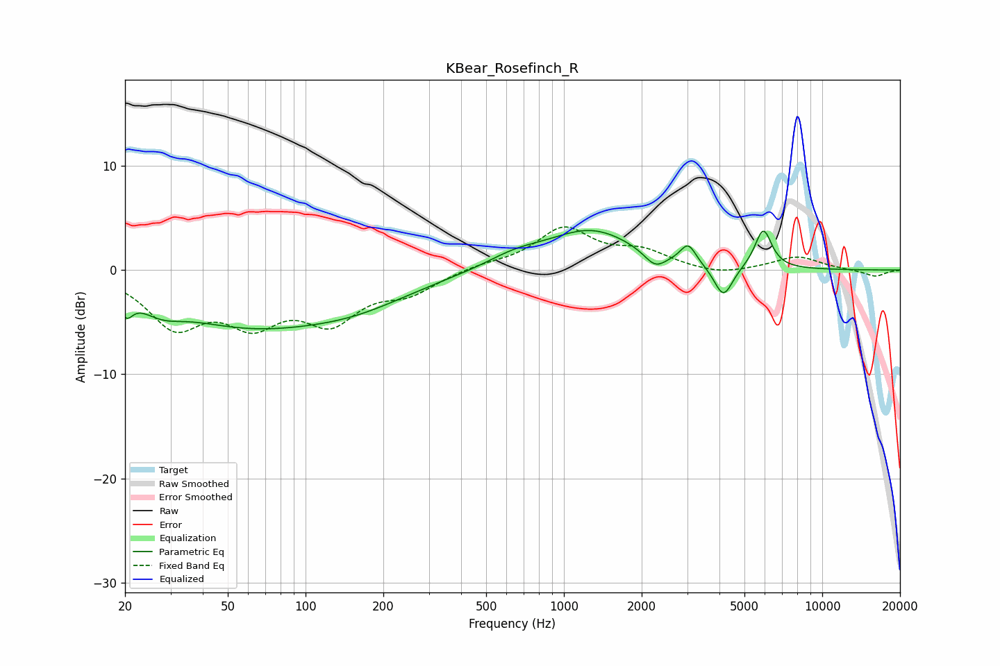

# KBear_Rosefinch_R
See [usage instructions](https://github.com/jaakkopasanen/AutoEq#usage) for more options and info.

### Parametric EQs
Apply preamp of -3.9 dB when using parametric equalizer.

|   # | Type    |   Fc (Hz) |    Q |   Gain (dB) |
|-----|---------|-----------|------|-------------|
|   1 | Peaking |        20 | 5.82 |        -1.8 |
|   2 | Peaking |        28 | 1.77 |        -1.4 |
|   3 | Peaking |        58 | 0.45 |        -4.7 |
|   4 | Peaking |       157 | 0.61 |        -2.2 |
|   5 | Peaking |       644 | 1.28 |         1   |
|   6 | Peaking |      1278 | 0.81 |         3.8 |
|   7 | Peaking |      2256 | 3.34 |        -1.5 |
|   8 | Peaking |      3029 | 4.71 |         1.9 |
|   9 | Peaking |      4147 | 3.85 |        -3.1 |
|  10 | Peaking |      5912 | 4.25 |         3.8 |

### Fixed Band EQs
When using fixed band (also called graphic) equalizer, apply preamp of **-4.2 dB** (if available) and set gains manually with these parameters.

|   # | Type    |   Fc (Hz) |    Q |   Gain (dB) |
|-----|---------|-----------|------|-------------|
|   1 | Peaking |        31 | 1.41 |        -5   |
|   2 | Peaking |        62 | 1.41 |        -4.3 |
|   3 | Peaking |       125 | 1.41 |        -4.4 |
|   4 | Peaking |       250 | 1.41 |        -1.9 |
|   5 | Peaking |       500 | 1.41 |         0.5 |
|   6 | Peaking |      1000 | 1.41 |         3.9 |
|   7 | Peaking |      2000 | 1.41 |         1.6 |
|   8 | Peaking |      4000 | 1.41 |        -0.6 |
|   9 | Peaking |      8000 | 1.41 |         1.3 |
|  10 | Peaking |     16000 | 1.41 |        -0.6 |

### Graphs

