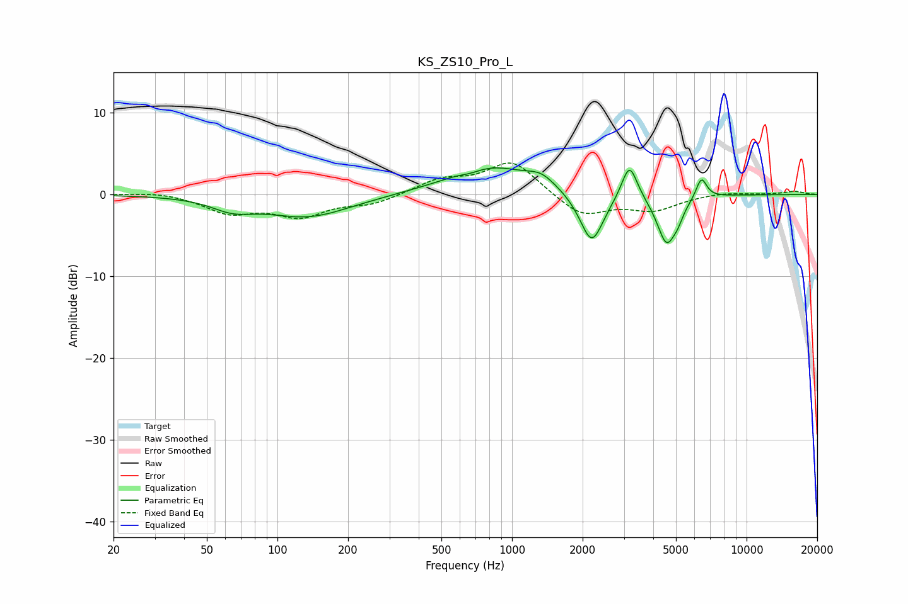

# KS_ZS10_Pro_L
See [usage instructions](https://github.com/jaakkopasanen/AutoEq#usage) for more options and info.

### Parametric EQs
Apply preamp of -3.3 dB when using parametric equalizer.

|   # | Type    |   Fc (Hz) |    Q |   Gain (dB) |
|-----|---------|-----------|------|-------------|
|   1 | Peaking |        64 | 1.61 |        -1.3 |
|   2 | Peaking |       135 | 0.78 |        -2.7 |
|   3 | Peaking |       669 | 3.11 |        -0.4 |
|   4 | Peaking |       799 | 0.8  |         3.5 |
|   5 | Peaking |      1333 | 2.37 |         1.3 |
|   6 | Peaking |      2186 | 2.77 |        -6.4 |
|   7 | Peaking |      3168 | 4.22 |         4.5 |
|   8 | Peaking |      4559 | 3.42 |        -5.9 |
|   9 | Peaking |      5102 | 5.99 |        -1.1 |
|  10 | Peaking |      6416 | 6    |         2.6 |

### Fixed Band EQs
When using fixed band (also called graphic) equalizer, apply preamp of **-3.9 dB** (if available) and set gains manually with these parameters.

|   # | Type    |   Fc (Hz) |    Q |   Gain (dB) |
|-----|---------|-----------|------|-------------|
|   1 | Peaking |        31 | 1.41 |         0.4 |
|   2 | Peaking |        62 | 1.41 |        -2.1 |
|   3 | Peaking |       125 | 1.41 |        -2.5 |
|   4 | Peaking |       250 | 1.41 |        -1.1 |
|   5 | Peaking |       500 | 1.41 |         1.7 |
|   6 | Peaking |      1000 | 1.41 |         4.1 |
|   7 | Peaking |      2000 | 1.41 |        -2.7 |
|   8 | Peaking |      4000 | 1.41 |        -1.8 |
|   9 | Peaking |      8000 | 1.41 |         0.3 |
|  10 | Peaking |     16000 | 1.41 |         0.4 |

### Graphs

