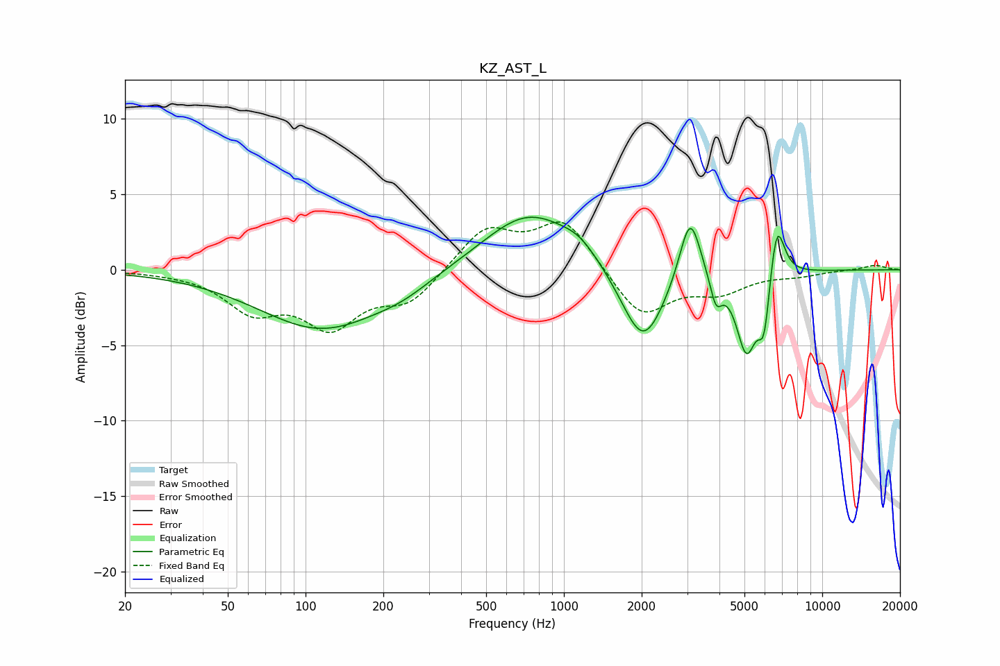

# KZ_AST_L
See [usage instructions](https://github.com/jaakkopasanen/AutoEq#usage) for more options and info.

### Parametric EQs
Apply preamp of -3.6 dB when using parametric equalizer.

|   # | Type    |   Fc (Hz) |    Q |   Gain (dB) |
|-----|---------|-----------|------|-------------|
|   1 | Peaking |       116 | 0.58 |        -3.9 |
|   2 | Peaking |       237 | 1.34 |        -0.6 |
|   3 | Peaking |       733 | 0.79 |         3.9 |
|   4 | Peaking |      1149 | 2.04 |         0.8 |
|   5 | Peaking |      2025 | 1.66 |        -5.3 |
|   6 | Peaking |      3079 | 3.41 |         4.6 |
|   7 | Peaking |      3878 | 6    |        -2   |
|   8 | Peaking |      5092 | 3.45 |        -5.3 |
|   9 | Peaking |      5960 | 6    |        -3.7 |
|  10 | Peaking |      6666 | 4.6  |         4.2 |

### Fixed Band EQs
When using fixed band (also called graphic) equalizer, apply preamp of **-3.3 dB** (if available) and set gains manually with these parameters.

|   # | Type    |   Fc (Hz) |    Q |   Gain (dB) |
|-----|---------|-----------|------|-------------|
|   1 | Peaking |        31 | 1.41 |        -0.1 |
|   2 | Peaking |        62 | 1.41 |        -2.5 |
|   3 | Peaking |       125 | 1.41 |        -3.4 |
|   4 | Peaking |       250 | 1.41 |        -2   |
|   5 | Peaking |       500 | 1.41 |         2.7 |
|   6 | Peaking |      1000 | 1.41 |         3.3 |
|   7 | Peaking |      2000 | 1.41 |        -3.2 |
|   8 | Peaking |      4000 | 1.41 |        -1.3 |
|   9 | Peaking |      8000 | 1.41 |        -0.3 |
|  10 | Peaking |     16000 | 1.41 |         0.3 |

### Graphs

