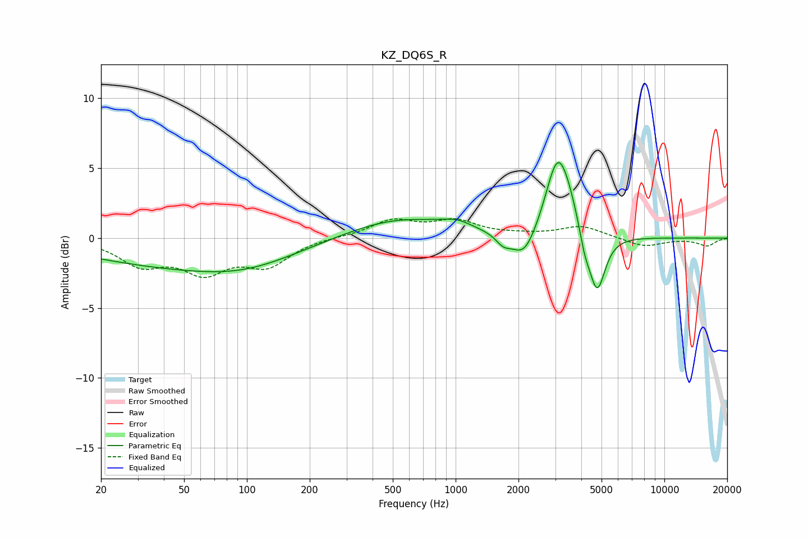

# KZ_DQ6S_R
See [usage instructions](https://github.com/jaakkopasanen/AutoEq#usage) for more options and info.

### Parametric EQs
Apply preamp of -5.5 dB when using parametric equalizer.

|   # | Type    |   Fc (Hz) |    Q |   Gain (dB) |
|-----|---------|-----------|------|-------------|
|   1 | Peaking |        49 | 0.29 |        -1.9 |
|   2 | Peaking |        97 | 0.61 |        -0.7 |
|   3 | Peaking |       540 | 0.55 |         1.5 |
|   4 | Peaking |      1013 | 2.05 |         0.5 |
|   5 | Peaking |      1692 | 3.93 |        -0.7 |
|   6 | Peaking |      2129 | 2.41 |        -2   |
|   7 | Peaking |      3067 | 2.49 |         5.2 |
|   8 | Peaking |      3474 | 2.55 |         1.4 |
|   9 | Peaking |      4147 | 5.48 |        -1.3 |
|  10 | Peaking |      4759 | 3.58 |        -4.3 |

### Fixed Band EQs
When using fixed band (also called graphic) equalizer, apply preamp of **-1.5 dB** (if available) and set gains manually with these parameters.

|   # | Type    |   Fc (Hz) |    Q |   Gain (dB) |
|-----|---------|-----------|------|-------------|
|   1 | Peaking |        31 | 1.41 |        -1.8 |
|   2 | Peaking |        62 | 1.41 |        -2.2 |
|   3 | Peaking |       125 | 1.41 |        -1.8 |
|   4 | Peaking |       250 | 1.41 |         0.1 |
|   5 | Peaking |       500 | 1.41 |         1.2 |
|   6 | Peaking |      1000 | 1.41 |         1.1 |
|   7 | Peaking |      2000 | 1.41 |         0.2 |
|   8 | Peaking |      4000 | 1.41 |         0.8 |
|   9 | Peaking |      8000 | 1.41 |        -0.6 |
|  10 | Peaking |     16000 | 1.41 |        -0.5 |

### Graphs

