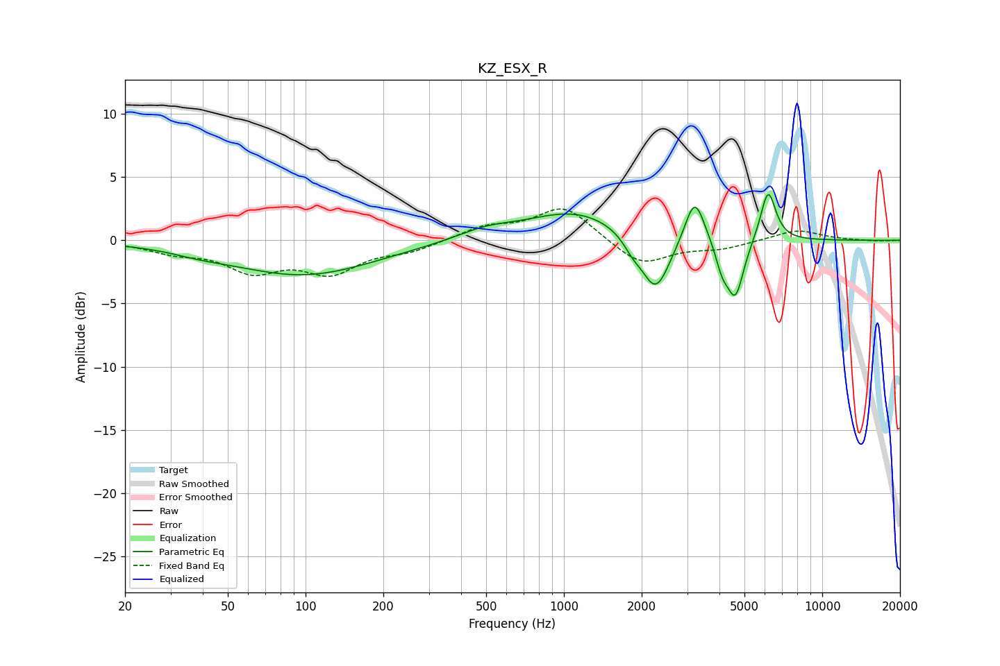

# KZ_ESX_R
See [usage instructions](https://github.com/jaakkopasanen/AutoEq#usage) for more options and info.

### Parametric EQs
Apply preamp of -3.7 dB when using parametric equalizer.

|   # | Type    |   Fc (Hz) |    Q |   Gain (dB) |
|-----|---------|-----------|------|-------------|
|   1 | Peaking |        39 | 1.4  |        -0.3 |
|   2 | Peaking |        98 | 0.51 |        -2.7 |
|   3 | Peaking |       496 | 1.27 |         0.7 |
|   4 | Peaking |      1113 | 0.74 |         2.3 |
|   5 | Peaking |      1846 | 3.92 |        -0.9 |
|   6 | Peaking |      2268 | 2.53 |        -4.6 |
|   7 | Peaking |      3209 | 3.73 |         3.7 |
|   8 | Peaking |      4098 | 5.48 |        -1.8 |
|   9 | Peaking |      4612 | 4.26 |        -4.5 |
|  10 | Peaking |      6173 | 4.65 |         4.1 |

### Fixed Band EQs
When using fixed band (also called graphic) equalizer, apply preamp of **-2.6 dB** (if available) and set gains manually with these parameters.

|   # | Type    |   Fc (Hz) |    Q |   Gain (dB) |
|-----|---------|-----------|------|-------------|
|   1 | Peaking |        31 | 1.41 |        -0.8 |
|   2 | Peaking |        62 | 1.41 |        -2.2 |
|   3 | Peaking |       125 | 1.41 |        -2.3 |
|   4 | Peaking |       250 | 1.41 |        -0.7 |
|   5 | Peaking |       500 | 1.41 |         1   |
|   6 | Peaking |      1000 | 1.41 |         2.7 |
|   7 | Peaking |      2000 | 1.41 |        -2   |
|   8 | Peaking |      4000 | 1.41 |        -0.6 |
|   9 | Peaking |      8000 | 1.41 |         0.9 |
|  10 | Peaking |     16000 | 1.41 |        -0.1 |

### Graphs

