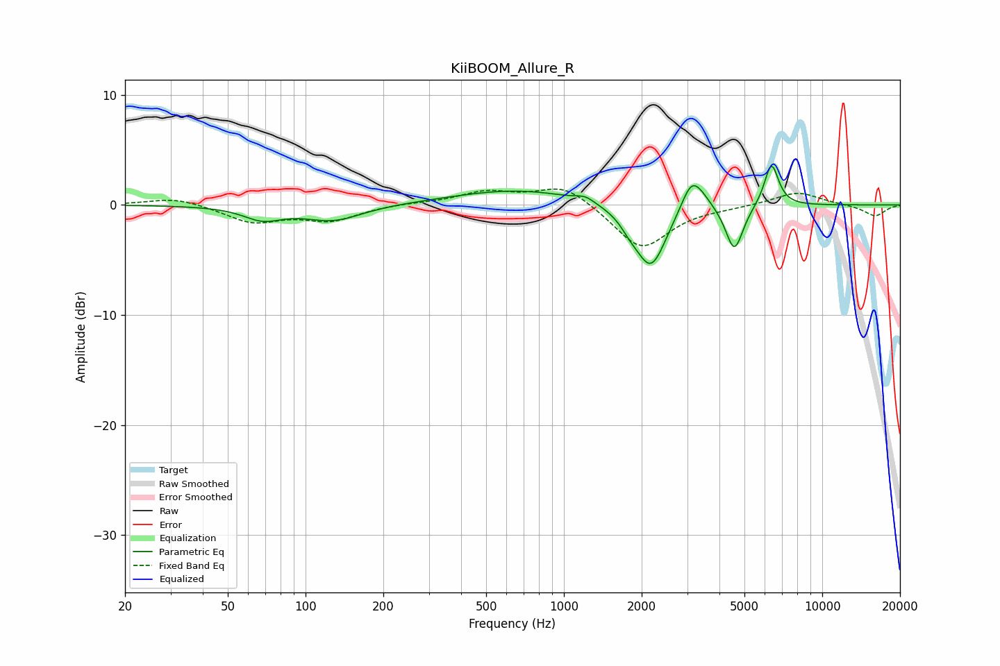

# KiiBOOM_Allure_R
See [usage instructions](https://github.com/jaakkopasanen/AutoEq#usage) for more options and info.

### Parametric EQs
Apply preamp of -3.6 dB when using parametric equalizer.

|   # | Type    |   Fc (Hz) |    Q |   Gain (dB) |
|-----|---------|-----------|------|-------------|
|   1 | Peaking |        68 | 1.9  |        -1.2 |
|   2 | Peaking |       128 | 1.25 |        -1.4 |
|   3 | Peaking |       661 | 0.57 |         1.4 |
|   4 | Peaking |      1209 | 4.02 |         0.5 |
|   5 | Peaking |      1797 | 3.96 |        -0.7 |
|   6 | Peaking |      2171 | 2.34 |        -5.8 |
|   7 | Peaking |      3117 | 3.51 |         2.8 |
|   8 | Peaking |      3438 | 3.26 |         0.7 |
|   9 | Peaking |      4570 | 4.17 |        -4.2 |
|  10 | Peaking |      6357 | 4.96 |         3.9 |

### Fixed Band EQs
When using fixed band (also called graphic) equalizer, apply preamp of **-1.5 dB** (if available) and set gains manually with these parameters.

|   # | Type    |   Fc (Hz) |    Q |   Gain (dB) |
|-----|---------|-----------|------|-------------|
|   1 | Peaking |        31 | 1.41 |         0.7 |
|   2 | Peaking |        62 | 1.41 |        -1.5 |
|   3 | Peaking |       125 | 1.41 |        -1.3 |
|   4 | Peaking |       250 | 1.41 |         0.2 |
|   5 | Peaking |       500 | 1.41 |         1.1 |
|   6 | Peaking |      1000 | 1.41 |         1.9 |
|   7 | Peaking |      2000 | 1.41 |        -4.1 |
|   8 | Peaking |      4000 | 1.41 |        -0.2 |
|   9 | Peaking |      8000 | 1.41 |         1.2 |
|  10 | Peaking |     16000 | 1.41 |        -1   |

### Graphs

