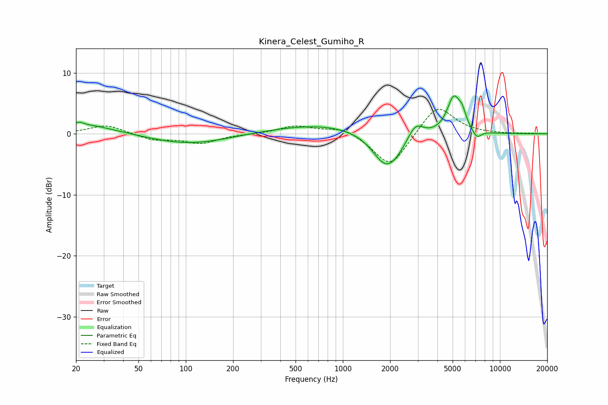

# Kinera_Celest_Gumiho_R
See [usage instructions](https://github.com/jaakkopasanen/AutoEq#usage) for more options and info.

### Parametric EQs
Apply preamp of -6.3 dB when using parametric equalizer.

|   # | Type    |   Fc (Hz) |    Q |   Gain (dB) |
|-----|---------|-----------|------|-------------|
|   1 | Peaking |        21 | 5.54 |         0.5 |
|   2 | Peaking |        22 | 0.73 |         1.6 |
|   3 | Peaking |       105 | 0.57 |        -1.7 |
|   4 | Peaking |       785 | 0.41 |         1.7 |
|   5 | Peaking |      1788 | 2.11 |        -1.4 |
|   6 | Peaking |      1999 | 1.41 |        -5.2 |
|   7 | Peaking |      2890 | 2.74 |         2.8 |
|   8 | Peaking |      5089 | 3.21 |         5.9 |
|   9 | Peaking |      5763 | 5.93 |         1.8 |
|  10 | Peaking |      7133 | 4.82 |        -1.3 |

### Fixed Band EQs
When using fixed band (also called graphic) equalizer, apply preamp of **-4.1 dB** (if available) and set gains manually with these parameters.

|   # | Type    |   Fc (Hz) |    Q |   Gain (dB) |
|-----|---------|-----------|------|-------------|
|   1 | Peaking |        31 | 1.41 |         1.5 |
|   2 | Peaking |        62 | 1.41 |        -1   |
|   3 | Peaking |       125 | 1.41 |        -1.5 |
|   4 | Peaking |       250 | 1.41 |        -0   |
|   5 | Peaking |       500 | 1.41 |         1.3 |
|   6 | Peaking |      1000 | 1.41 |         1.2 |
|   7 | Peaking |      2000 | 1.41 |        -5.7 |
|   8 | Peaking |      4000 | 1.41 |         4.9 |
|   9 | Peaking |      8000 | 1.41 |         0   |
|  10 | Peaking |     16000 | 1.41 |         0   |

### Graphs

