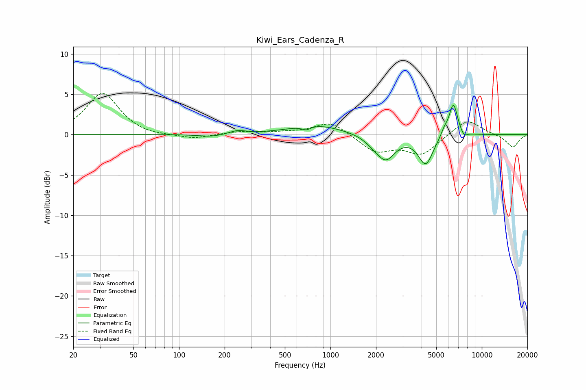

# Kiwi_Ears_Cadenza_R
See [usage instructions](https://github.com/jaakkopasanen/AutoEq#usage) for more options and info.

### Parametric EQs
Apply preamp of -3.7 dB when using parametric equalizer.

|   # | Type    |   Fc (Hz) |    Q |   Gain (dB) |
|-----|---------|-----------|------|-------------|
|   1 | Peaking |       163 | 1.72 |        -0.3 |
|   2 | Peaking |       243 | 2.72 |         0.4 |
|   3 | Peaking |       692 | 4.91 |        -0.5 |
|   4 | Peaking |       802 | 0.83 |         1.2 |
|   5 | Peaking |      1916 | 2.66 |        -0.6 |
|   6 | Peaking |      2324 | 2.33 |        -2.9 |
|   7 | Peaking |      4261 | 2.9  |        -3.6 |
|   8 | Peaking |      5644 | 6    |         0.7 |
|   9 | Peaking |      6488 | 4.74 |         4.1 |
|  10 | Peaking |      7597 | 6    |        -0.7 |

### Fixed Band EQs
When using fixed band (also called graphic) equalizer, apply preamp of **-5.2 dB** (if available) and set gains manually with these parameters.

|   # | Type    |   Fc (Hz) |    Q |   Gain (dB) |
|-----|---------|-----------|------|-------------|
|   1 | Peaking |        31 | 1.41 |         5.2 |
|   2 | Peaking |        62 | 1.41 |        -0.3 |
|   3 | Peaking |       125 | 1.41 |        -0.6 |
|   4 | Peaking |       250 | 1.41 |         0.4 |
|   5 | Peaking |       500 | 1.41 |         0.2 |
|   6 | Peaking |      1000 | 1.41 |         1.7 |
|   7 | Peaking |      2000 | 1.41 |        -2.1 |
|   8 | Peaking |      4000 | 1.41 |        -2.4 |
|   9 | Peaking |      8000 | 1.41 |         2   |
|  10 | Peaking |     16000 | 1.41 |        -1.6 |

### Graphs

