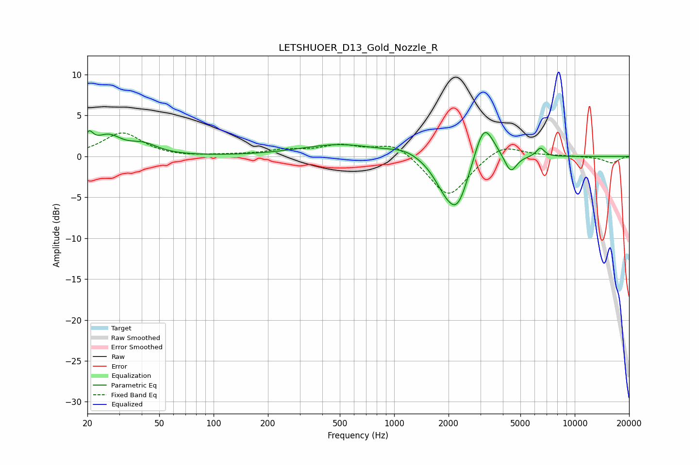

# LETSHUOER_D13_Gold_Nozzle_R
See [usage instructions](https://github.com/jaakkopasanen/AutoEq#usage) for more options and info.

### Parametric EQs
Apply preamp of -3.2 dB when using parametric equalizer.

|   # | Type    |   Fc (Hz) |    Q |   Gain (dB) |
|-----|---------|-----------|------|-------------|
|   1 | Peaking |        20 | 5.92 |         1.8 |
|   2 | Peaking |        26 | 1.98 |         2.2 |
|   3 | Peaking |        41 | 1.78 |         1.2 |
|   4 | Peaking |       498 | 0.66 |         1.4 |
|   5 | Peaking |      1153 | 1.63 |         0.8 |
|   6 | Peaking |      1885 | 2.27 |        -1.8 |
|   7 | Peaking |      2236 | 2.1  |        -6.1 |
|   8 | Peaking |      3139 | 2.56 |         5.1 |
|   9 | Peaking |      4416 | 4.27 |        -2.2 |
|  10 | Peaking |      6452 | 6    |         1.1 |

### Fixed Band EQs
When using fixed band (also called graphic) equalizer, apply preamp of **-3.0 dB** (if available) and set gains manually with these parameters.

|   # | Type    |   Fc (Hz) |    Q |   Gain (dB) |
|-----|---------|-----------|------|-------------|
|   1 | Peaking |        31 | 1.41 |         2.9 |
|   2 | Peaking |        62 | 1.41 |        -0.1 |
|   3 | Peaking |       125 | 1.41 |         0.1 |
|   4 | Peaking |       250 | 1.41 |         0.7 |
|   5 | Peaking |       500 | 1.41 |         1.2 |
|   6 | Peaking |      1000 | 1.41 |         1.7 |
|   7 | Peaking |      2000 | 1.41 |        -5.1 |
|   8 | Peaking |      4000 | 1.41 |         1.7 |
|   9 | Peaking |      8000 | 1.41 |         0.1 |
|  10 | Peaking |     16000 | 1.41 |        -0.8 |

### Graphs

