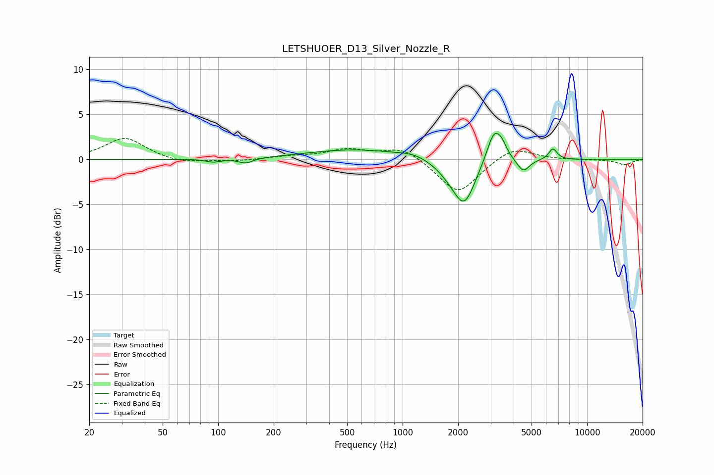

# LETSHUOER_D13_Silver_Nozzle_R
See [usage instructions](https://github.com/jaakkopasanen/AutoEq#usage) for more options and info.

### Parametric EQs
Apply preamp of -3.0 dB when using parametric equalizer.

|   # | Type    |   Fc (Hz) |    Q |   Gain (dB) |
|-----|---------|-----------|------|-------------|
|   1 | Peaking |        94 | 3.45 |        -0.4 |
|   2 | Peaking |       141 | 3.66 |        -0.6 |
|   3 | Peaking |       548 | 0.55 |         1.1 |
|   4 | Peaking |      1143 | 1.78 |         0.4 |
|   5 | Peaking |      1834 | 1.86 |        -1.1 |
|   6 | Peaking |      2165 | 2.41 |        -4.5 |
|   7 | Peaking |      3144 | 3.46 |         3.7 |
|   8 | Peaking |      3470 | 6    |         0.8 |
|   9 | Peaking |      4505 | 4.18 |        -1.5 |
|  10 | Peaking |      6530 | 6    |         1.2 |

### Fixed Band EQs
When using fixed band (also called graphic) equalizer, apply preamp of **-2.4 dB** (if available) and set gains manually with these parameters.

|   # | Type    |   Fc (Hz) |    Q |   Gain (dB) |
|-----|---------|-----------|------|-------------|
|   1 | Peaking |        31 | 1.41 |         2.4 |
|   2 | Peaking |        62 | 1.41 |        -0.5 |
|   3 | Peaking |       125 | 1.41 |        -0.2 |
|   4 | Peaking |       250 | 1.41 |         0.3 |
|   5 | Peaking |       500 | 1.41 |         1   |
|   6 | Peaking |      1000 | 1.41 |         1.4 |
|   7 | Peaking |      2000 | 1.41 |        -3.9 |
|   8 | Peaking |      4000 | 1.41 |         1.5 |
|   9 | Peaking |      8000 | 1.41 |        -0   |
|  10 | Peaking |     16000 | 1.41 |        -0.6 |

### Graphs

