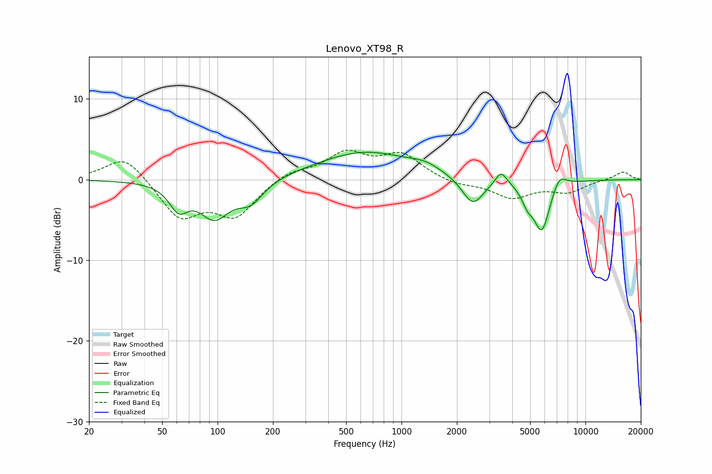

# Lenovo_XT98_R
See [usage instructions](https://github.com/jaakkopasanen/AutoEq#usage) for more options and info.

### Parametric EQs
Apply preamp of -3.5 dB when using parametric equalizer.

|   # | Type    |   Fc (Hz) |    Q |   Gain (dB) |
|-----|---------|-----------|------|-------------|
|   1 | Peaking |        61 | 2.82 |        -2.9 |
|   2 | Peaking |        96 | 1.69 |        -4.4 |
|   3 | Peaking |       151 | 2.01 |        -2.5 |
|   4 | Peaking |       633 | 0.54 |         3.4 |
|   5 | Peaking |      1344 | 1.82 |         0.7 |
|   6 | Peaking |      2443 | 2.39 |        -3.5 |
|   7 | Peaking |      3480 | 4.45 |         1.7 |
|   8 | Peaking |      4837 | 4.55 |        -1.7 |
|   9 | Peaking |      5792 | 3.06 |        -6.3 |
|  10 | Peaking |      7207 | 3.65 |         1.7 |

### Fixed Band EQs
When using fixed band (also called graphic) equalizer, apply preamp of **-3.8 dB** (if available) and set gains manually with these parameters.

|   # | Type    |   Fc (Hz) |    Q |   Gain (dB) |
|-----|---------|-----------|------|-------------|
|   1 | Peaking |        31 | 1.41 |         3.2 |
|   2 | Peaking |        62 | 1.41 |        -4.6 |
|   3 | Peaking |       125 | 1.41 |        -4.3 |
|   4 | Peaking |       250 | 1.41 |         1.1 |
|   5 | Peaking |       500 | 1.41 |         3.1 |
|   6 | Peaking |      1000 | 1.41 |         3   |
|   7 | Peaking |      2000 | 1.41 |        -0.7 |
|   8 | Peaking |      4000 | 1.41 |        -2.2 |
|   9 | Peaking |      8000 | 1.41 |        -1.4 |
|  10 | Peaking |     16000 | 1.41 |         1   |

### Graphs

