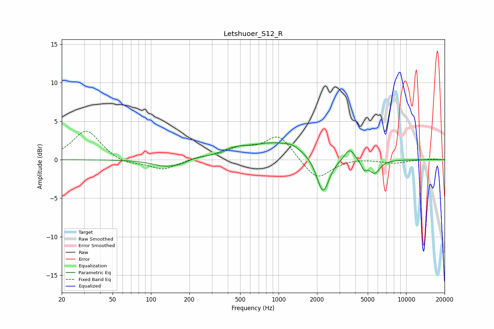

# Letshuoer_S12_R
See [usage instructions](https://github.com/jaakkopasanen/AutoEq#usage) for more options and info.

### Parametric EQs
Apply preamp of -2.3 dB when using parametric equalizer.

|   # | Type    |   Fc (Hz) |    Q |   Gain (dB) |
|-----|---------|-----------|------|-------------|
|   1 | Peaking |       131 | 1.33 |        -0.9 |
|   2 | Peaking |       175 | 1.98 |        -0.4 |
|   3 | Peaking |       208 | 1.86 |         0.3 |
|   4 | Peaking |       453 | 1.45 |         0.7 |
|   5 | Peaking |       964 | 0.65 |         2.2 |
|   6 | Peaking |      1285 | 2.97 |         0.3 |
|   7 | Peaking |      2230 | 2.88 |        -4.9 |
|   8 | Peaking |      3604 | 3.69 |         1.6 |
|   9 | Peaking |      4682 | 6    |        -1.1 |
|  10 | Peaking |      5650 | 3.28 |        -1.8 |

### Fixed Band EQs
When using fixed band (also called graphic) equalizer, apply preamp of **-3.8 dB** (if available) and set gains manually with these parameters.

|   # | Type    |   Fc (Hz) |    Q |   Gain (dB) |
|-----|---------|-----------|------|-------------|
|   1 | Peaking |        31 | 1.41 |         3.9 |
|   2 | Peaking |        62 | 1.41 |        -0.7 |
|   3 | Peaking |       125 | 1.41 |        -1.3 |
|   4 | Peaking |       250 | 1.41 |         0.3 |
|   5 | Peaking |       500 | 1.41 |         1.3 |
|   6 | Peaking |      1000 | 1.41 |         3.2 |
|   7 | Peaking |      2000 | 1.41 |        -2.7 |
|   8 | Peaking |      4000 | 1.41 |         0.2 |
|   9 | Peaking |      8000 | 1.41 |        -0.4 |
|  10 | Peaking |     16000 | 1.41 |         0.1 |

### Graphs

