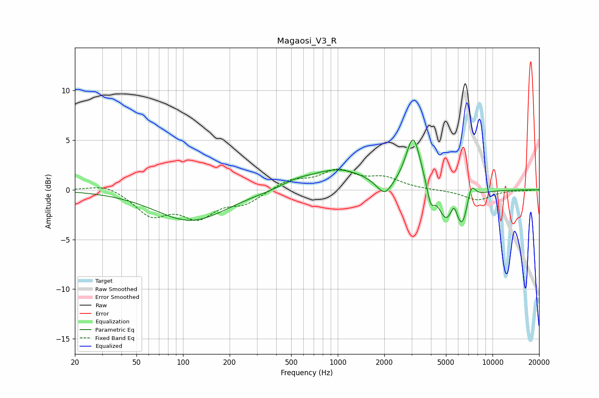

# Magaosi_V3_R
See [usage instructions](https://github.com/jaakkopasanen/AutoEq#usage) for more options and info.

### Parametric EQs
Apply preamp of -5.1 dB when using parametric equalizer.

|   # | Type    |   Fc (Hz) |    Q |   Gain (dB) |
|-----|---------|-----------|------|-------------|
|   1 | Peaking |       113 | 0.62 |        -3.1 |
|   2 | Peaking |       538 | 1.58 |         0.5 |
|   3 | Peaking |      1008 | 0.74 |         2   |
|   4 | Peaking |      2009 | 2.82 |        -1.7 |
|   5 | Peaking |      3075 | 2.95 |         5.4 |
|   6 | Peaking |      3988 | 6    |        -1.9 |
|   7 | Peaking |      4978 | 2.99 |        -2.6 |
|   8 | Peaking |      5654 | 6    |         1.5 |
|   9 | Peaking |      6354 | 2.88 |        -3.8 |
|  10 | Peaking |      7264 | 4.81 |         2.1 |

### Fixed Band EQs
When using fixed band (also called graphic) equalizer, apply preamp of **-2.2 dB** (if available) and set gains manually with these parameters.

|   # | Type    |   Fc (Hz) |    Q |   Gain (dB) |
|-----|---------|-----------|------|-------------|
|   1 | Peaking |        31 | 1.41 |         0.7 |
|   2 | Peaking |        62 | 1.41 |        -2.4 |
|   3 | Peaking |       125 | 1.41 |        -2.5 |
|   4 | Peaking |       250 | 1.41 |        -1.2 |
|   5 | Peaking |       500 | 1.41 |         1   |
|   6 | Peaking |      1000 | 1.41 |         1.8 |
|   7 | Peaking |      2000 | 1.41 |         1.1 |
|   8 | Peaking |      4000 | 1.41 |        -0   |
|   9 | Peaking |      8000 | 1.41 |        -1   |
|  10 | Peaking |     16000 | 1.41 |        -0.1 |

### Graphs

