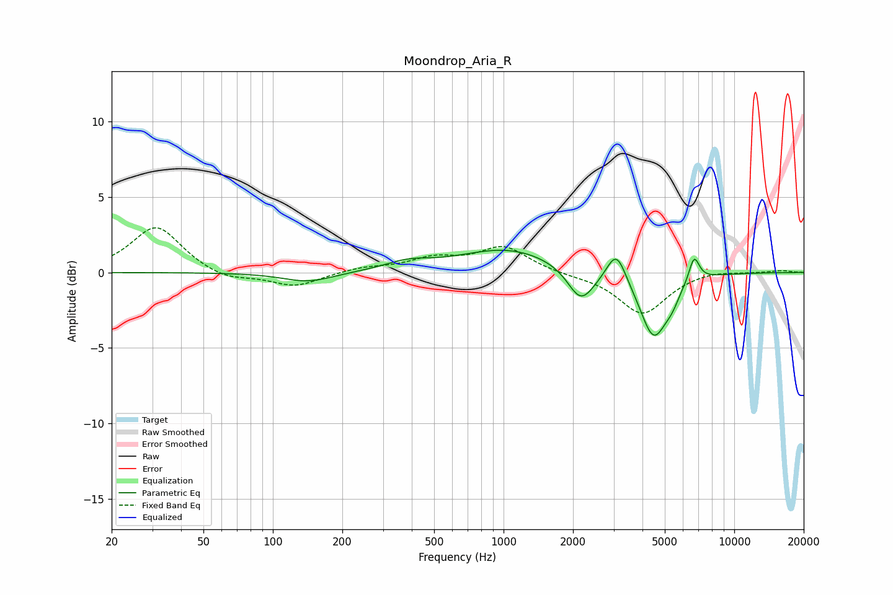

# Moondrop_Aria_R
See [usage instructions](https://github.com/jaakkopasanen/AutoEq#usage) for more options and info.

### Parametric EQs
Apply preamp of -1.6 dB when using parametric equalizer.

|   # | Type    |   Fc (Hz) |    Q |   Gain (dB) |
|-----|---------|-----------|------|-------------|
|   1 | Peaking |       142 | 1.3  |        -0.7 |
|   2 | Peaking |       384 | 1.45 |         0.5 |
|   3 | Peaking |      1049 | 0.67 |         1.6 |
|   4 | Peaking |      2148 | 2.58 |        -1.9 |
|   5 | Peaking |      2346 | 2.04 |        -0.4 |
|   6 | Peaking |      2962 | 3.2  |         0.3 |
|   7 | Peaking |      3100 | 3.61 |         1.7 |
|   8 | Peaking |      4474 | 2.33 |        -4.3 |
|   9 | Peaking |      5384 | 4.29 |        -0.7 |
|  10 | Peaking |      6699 | 6    |         1.7 |

### Fixed Band EQs
When using fixed band (also called graphic) equalizer, apply preamp of **-3.1 dB** (if available) and set gains manually with these parameters.

|   # | Type    |   Fc (Hz) |    Q |   Gain (dB) |
|-----|---------|-----------|------|-------------|
|   1 | Peaking |        31 | 1.41 |         3.1 |
|   2 | Peaking |        62 | 1.41 |        -0.6 |
|   3 | Peaking |       125 | 1.41 |        -0.9 |
|   4 | Peaking |       250 | 1.41 |         0.3 |
|   5 | Peaking |       500 | 1.41 |         0.8 |
|   6 | Peaking |      1000 | 1.41 |         1.7 |
|   7 | Peaking |      2000 | 1.41 |        -0.1 |
|   8 | Peaking |      4000 | 1.41 |        -2.7 |
|   9 | Peaking |      8000 | 1.41 |         0.2 |
|  10 | Peaking |     16000 | 1.41 |         0.1 |

### Graphs

