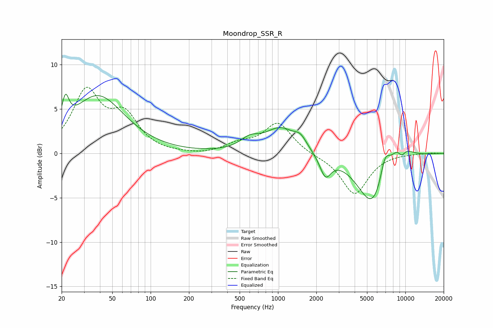

# Moondrop_SSR_R
See [usage instructions](https://github.com/jaakkopasanen/AutoEq#usage) for more options and info.

### Parametric EQs
Apply preamp of -6.8 dB when using parametric equalizer.

|   # | Type    |   Fc (Hz) |    Q |   Gain (dB) |
|-----|---------|-----------|------|-------------|
|   1 | Peaking |        21 | 5.27 |         2.9 |
|   2 | Peaking |        38 | 0.69 |         6.4 |
|   3 | Peaking |       602 | 1.85 |         1.1 |
|   4 | Peaking |      1046 | 1.19 |         2.7 |
|   5 | Peaking |      1502 | 2.85 |         1.1 |
|   6 | Peaking |      2356 | 3.28 |        -2.4 |
|   7 | Peaking |      5592 | 1.14 |        -6.3 |
|   8 | Peaking |      6911 | 3.41 |         2.9 |
|   9 | Peaking |      8982 | 1.64 |         2.8 |
|  10 | Peaking |      9351 | 3.94 |        -1.4 |

### Fixed Band EQs
When using fixed band (also called graphic) equalizer, apply preamp of **-7.5 dB** (if available) and set gains manually with these parameters.

|   # | Type    |   Fc (Hz) |    Q |   Gain (dB) |
|-----|---------|-----------|------|-------------|
|   1 | Peaking |        31 | 1.41 |         6.7 |
|   2 | Peaking |        62 | 1.41 |         3.8 |
|   3 | Peaking |       125 | 1.41 |        -0   |
|   4 | Peaking |       250 | 1.41 |        -0.2 |
|   5 | Peaking |       500 | 1.41 |         0.9 |
|   6 | Peaking |      1000 | 1.41 |         3.4 |
|   7 | Peaking |      2000 | 1.41 |        -0.2 |
|   8 | Peaking |      4000 | 1.41 |        -4.6 |
|   9 | Peaking |      8000 | 1.41 |         0   |
|  10 | Peaking |     16000 | 1.41 |         0.1 |

### Graphs

