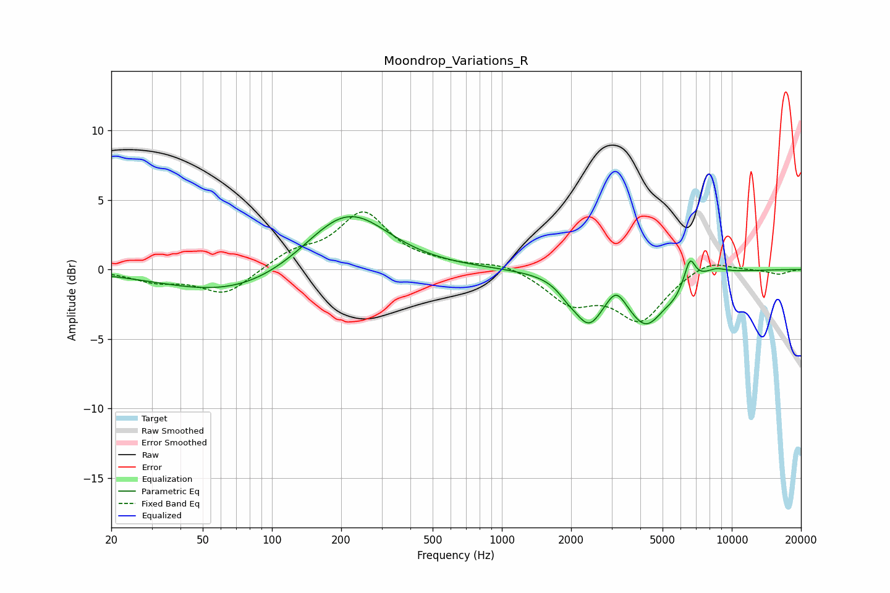

# Moondrop_Variations_R
See [usage instructions](https://github.com/jaakkopasanen/AutoEq#usage) for more options and info.

### Parametric EQs
Apply preamp of -3.9 dB when using parametric equalizer.

|   # | Type    |   Fc (Hz) |    Q |   Gain (dB) |
|-----|---------|-----------|------|-------------|
|   1 | Peaking |        70 | 0.48 |        -1.9 |
|   2 | Peaking |       204 | 0.79 |         4   |
|   3 | Peaking |       253 | 1.07 |         0.6 |
|   4 | Peaking |      1932 | 3.33 |        -0.6 |
|   5 | Peaking |      2387 | 2.22 |        -3.2 |
|   6 | Peaking |      3145 | 3.67 |         1.1 |
|   7 | Peaking |      4236 | 1.67 |        -3.7 |
|   8 | Peaking |      5593 | 3.41 |        -0.6 |
|   9 | Peaking |      6579 | 6    |         1.8 |
|  10 | Peaking |      8536 | 2.84 |         0.4 |

### Fixed Band EQs
When using fixed band (also called graphic) equalizer, apply preamp of **-4.2 dB** (if available) and set gains manually with these parameters.

|   # | Type    |   Fc (Hz) |    Q |   Gain (dB) |
|-----|---------|-----------|------|-------------|
|   1 | Peaking |        31 | 1.41 |        -0.8 |
|   2 | Peaking |        62 | 1.41 |        -1.8 |
|   3 | Peaking |       125 | 1.41 |         1.1 |
|   4 | Peaking |       250 | 1.41 |         4   |
|   5 | Peaking |       500 | 1.41 |         0.3 |
|   6 | Peaking |      1000 | 1.41 |         0.5 |
|   7 | Peaking |      2000 | 1.41 |        -2.2 |
|   8 | Peaking |      4000 | 1.41 |        -3.5 |
|   9 | Peaking |      8000 | 1.41 |         0.8 |
|  10 | Peaking |     16000 | 1.41 |        -0.3 |

### Graphs

