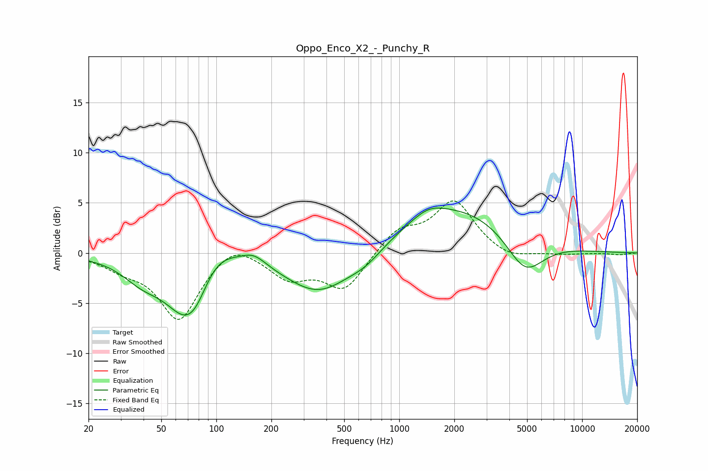

# Oppo_Enco_X2_-_Punchy_R
See [usage instructions](https://github.com/jaakkopasanen/AutoEq#usage) for more options and info.

### Parametric EQs
Apply preamp of -4.6 dB when using parametric equalizer.

|   # | Type    |   Fc (Hz) |    Q |   Gain (dB) |
|-----|---------|-----------|------|-------------|
|   1 | Peaking |        39 | 1.29 |        -1.8 |
|   2 | Peaking |        69 | 1.19 |        -6.1 |
|   3 | Peaking |        77 | 2.42 |        -1   |
|   4 | Peaking |        99 | 1.27 |         2.6 |
|   5 | Peaking |       160 | 2.11 |         1.1 |
|   6 | Peaking |       366 | 0.77 |        -4.2 |
|   7 | Peaking |       658 | 1.47 |        -1.1 |
|   8 | Peaking |      1442 | 1.69 |         0.9 |
|   9 | Peaking |      2059 | 0.42 |         4.6 |
|  10 | Peaking |      4865 | 1.34 |        -4   |

### Fixed Band EQs
When using fixed band (also called graphic) equalizer, apply preamp of **-5.3 dB** (if available) and set gains manually with these parameters.

|   # | Type    |   Fc (Hz) |    Q |   Gain (dB) |
|-----|---------|-----------|------|-------------|
|   1 | Peaking |        31 | 1.41 |        -1.2 |
|   2 | Peaking |        62 | 1.41 |        -6.6 |
|   3 | Peaking |       125 | 1.41 |         1.5 |
|   4 | Peaking |       250 | 1.41 |        -2.3 |
|   5 | Peaking |       500 | 1.41 |        -3.6 |
|   6 | Peaking |      1000 | 1.41 |         2.2 |
|   7 | Peaking |      2000 | 1.41 |         5.1 |
|   8 | Peaking |      4000 | 1.41 |        -0.8 |
|   9 | Peaking |      8000 | 1.41 |        -0.2 |
|  10 | Peaking |     16000 | 1.41 |        -0.2 |

### Graphs

