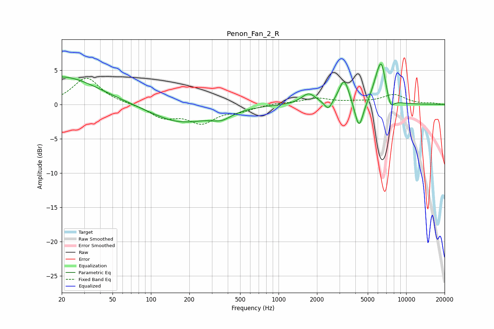

# Penon_Fan_2_R
See [usage instructions](https://github.com/jaakkopasanen/AutoEq#usage) for more options and info.

### Parametric EQs
Apply preamp of -6.0 dB when using parametric equalizer.

|   # | Type    |   Fc (Hz) |    Q |   Gain (dB) |
|-----|---------|-----------|------|-------------|
|   1 | Peaking |        20 | 0.5  |         4.1 |
|   2 | Peaking |       169 | 0.62 |        -2.6 |
|   3 | Peaking |       358 | 1.77 |        -1.1 |
|   4 | Peaking |      1720 | 2.57 |         1.6 |
|   5 | Peaking |      2453 | 4.75 |        -1.4 |
|   6 | Peaking |      3264 | 3.5  |         3.7 |
|   7 | Peaking |      4272 | 4.19 |        -4.2 |
|   8 | Peaking |      5905 | 3.11 |         2   |
|   9 | Peaking |      6410 | 3.96 |         4.9 |
|  10 | Peaking |      7538 | 4.83 |        -1.7 |

### Fixed Band EQs
When using fixed band (also called graphic) equalizer, apply preamp of **-3.9 dB** (if available) and set gains manually with these parameters.

|   # | Type    |   Fc (Hz) |    Q |   Gain (dB) |
|-----|---------|-----------|------|-------------|
|   1 | Peaking |        31 | 1.41 |         3.9 |
|   2 | Peaking |        62 | 1.41 |         0.1 |
|   3 | Peaking |       125 | 1.41 |        -1.8 |
|   4 | Peaking |       250 | 1.41 |        -2.5 |
|   5 | Peaking |       500 | 1.41 |        -0.8 |
|   6 | Peaking |      1000 | 1.41 |         0.2 |
|   7 | Peaking |      2000 | 1.41 |         0.9 |
|   8 | Peaking |      4000 | 1.41 |         0.3 |
|   9 | Peaking |      8000 | 1.41 |         1.4 |
|  10 | Peaking |     16000 | 1.41 |         0.2 |

### Graphs

