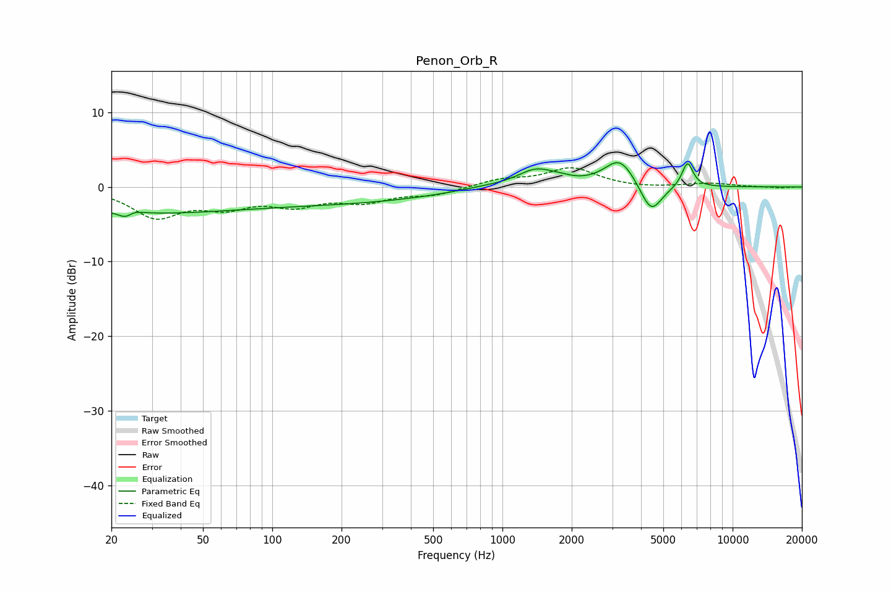

# Penon_Orb_R
See [usage instructions](https://github.com/jaakkopasanen/AutoEq#usage) for more options and info.

### Parametric EQs
Apply preamp of -3.3 dB when using parametric equalizer.

|   # | Type    |   Fc (Hz) |    Q |   Gain (dB) |
|-----|---------|-----------|------|-------------|
|   1 | Peaking |        24 | 4.03 |        -3.2 |
|   2 | Peaking |        24 | 3.91 |         2.8 |
|   3 | Peaking |        26 | 0.34 |        -3.2 |
|   4 | Peaking |       198 | 0.33 |        -1.9 |
|   5 | Peaking |       840 | 1.05 |         0.4 |
|   6 | Peaking |      1402 | 1.73 |         2.3 |
|   7 | Peaking |      1798 | 2.93 |         0.3 |
|   8 | Peaking |      3240 | 2.09 |         3.8 |
|   9 | Peaking |      4424 | 2.94 |        -4.1 |
|  10 | Peaking |      6366 | 5.65 |         3.4 |

### Fixed Band EQs
When using fixed band (also called graphic) equalizer, apply preamp of **-2.7 dB** (if available) and set gains manually with these parameters.

|   # | Type    |   Fc (Hz) |    Q |   Gain (dB) |
|-----|---------|-----------|------|-------------|
|   1 | Peaking |        31 | 1.41 |        -3.8 |
|   2 | Peaking |        62 | 1.41 |        -2.2 |
|   3 | Peaking |       125 | 1.41 |        -2.1 |
|   4 | Peaking |       250 | 1.41 |        -1.7 |
|   5 | Peaking |       500 | 1.41 |        -1   |
|   6 | Peaking |      1000 | 1.41 |         1   |
|   7 | Peaking |      2000 | 1.41 |         2.5 |
|   8 | Peaking |      4000 | 1.41 |        -0.2 |
|   9 | Peaking |      8000 | 1.41 |         0.5 |
|  10 | Peaking |     16000 | 1.41 |        -0.1 |

### Graphs

