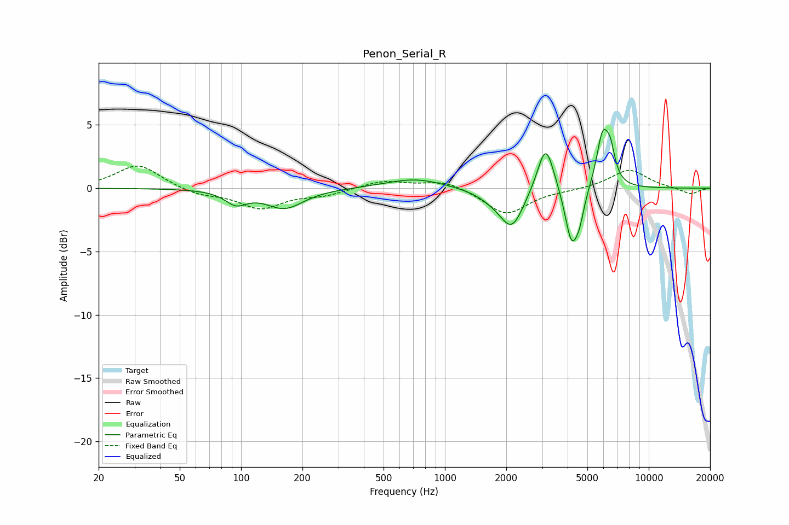

# Penon_Serial_R
See [usage instructions](https://github.com/jaakkopasanen/AutoEq#usage) for more options and info.

### Parametric EQs
Apply preamp of -4.7 dB when using parametric equalizer.

|   # | Type    |   Fc (Hz) |    Q |   Gain (dB) |
|-----|---------|-----------|------|-------------|
|   1 | Peaking |        94 | 2.7  |        -1   |
|   2 | Peaking |       164 | 1.51 |        -1.5 |
|   3 | Peaking |       713 | 0.99 |         0.8 |
|   4 | Peaking |      1778 | 1.69 |        -0.7 |
|   5 | Peaking |      2137 | 2.51 |        -2.8 |
|   6 | Peaking |      3123 | 3.48 |         3.9 |
|   7 | Peaking |      4183 | 4.33 |        -4.3 |
|   8 | Peaking |      4582 | 6    |        -1.5 |
|   9 | Peaking |      5939 | 4.58 |         4.1 |
|  10 | Peaking |      6485 | 6    |         2   |

### Fixed Band EQs
When using fixed band (also called graphic) equalizer, apply preamp of **-1.8 dB** (if available) and set gains manually with these parameters.

|   # | Type    |   Fc (Hz) |    Q |   Gain (dB) |
|-----|---------|-----------|------|-------------|
|   1 | Peaking |        31 | 1.41 |         1.9 |
|   2 | Peaking |        62 | 1.41 |        -0.5 |
|   3 | Peaking |       125 | 1.41 |        -1.5 |
|   4 | Peaking |       250 | 1.41 |        -0.5 |
|   5 | Peaking |       500 | 1.41 |         0.6 |
|   6 | Peaking |      1000 | 1.41 |         0.7 |
|   7 | Peaking |      2000 | 1.41 |        -2.1 |
|   8 | Peaking |      4000 | 1.41 |        -0.1 |
|   9 | Peaking |      8000 | 1.41 |         1.5 |
|  10 | Peaking |     16000 | 1.41 |        -0.5 |

### Graphs

