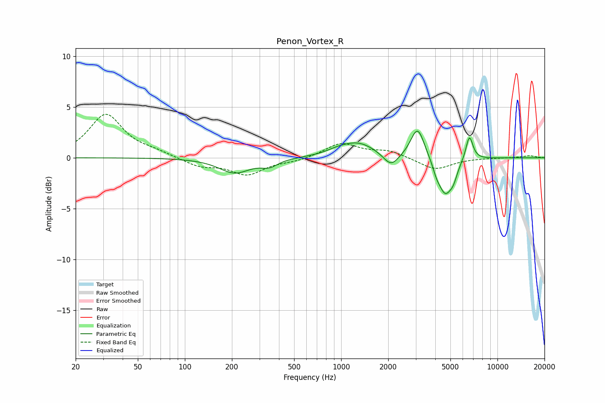

# Penon_Vortex_R
See [usage instructions](https://github.com/jaakkopasanen/AutoEq#usage) for more options and info.

### Parametric EQs
Apply preamp of -2.7 dB when using parametric equalizer.

|   # | Type    |   Fc (Hz) |    Q |   Gain (dB) |
|-----|---------|-----------|------|-------------|
|   1 | Peaking |       208 | 1.42 |        -1.5 |
|   2 | Peaking |       348 | 2.7  |        -0.7 |
|   3 | Peaking |       938 | 2.12 |         0.3 |
|   4 | Peaking |      1277 | 1.23 |         1.5 |
|   5 | Peaking |      2085 | 2.88 |        -1.3 |
|   6 | Peaking |      3085 | 3.23 |         3.1 |
|   7 | Peaking |      4077 | 6    |        -0.7 |
|   8 | Peaking |      4630 | 3.08 |        -3.5 |
|   9 | Peaking |      5225 | 5.55 |        -1   |
|  10 | Peaking |      6614 | 5.99 |         2.5 |

### Fixed Band EQs
When using fixed band (also called graphic) equalizer, apply preamp of **-4.4 dB** (if available) and set gains manually with these parameters.

|   # | Type    |   Fc (Hz) |    Q |   Gain (dB) |
|-----|---------|-----------|------|-------------|
|   1 | Peaking |        31 | 1.41 |         4.2 |
|   2 | Peaking |        62 | 1.41 |         0.5 |
|   3 | Peaking |       125 | 1.41 |        -0.8 |
|   4 | Peaking |       250 | 1.41 |        -1.6 |
|   5 | Peaking |       500 | 1.41 |        -0.3 |
|   6 | Peaking |      1000 | 1.41 |         1.4 |
|   7 | Peaking |      2000 | 1.41 |         0.7 |
|   8 | Peaking |      4000 | 1.41 |        -1.2 |
|   9 | Peaking |      8000 | 1.41 |        -0   |
|  10 | Peaking |     16000 | 1.41 |         0.2 |

### Graphs

