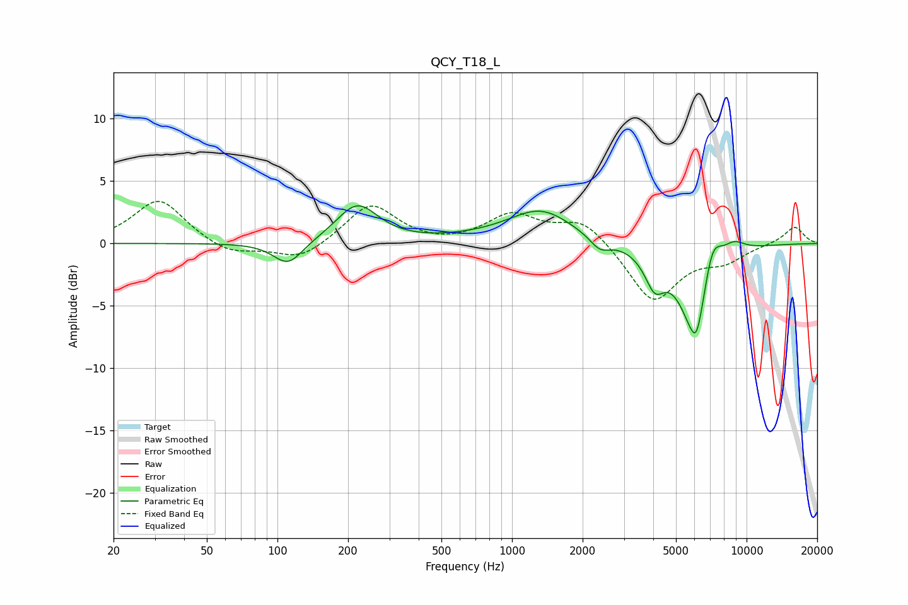

# QCY_T18_L
See [usage instructions](https://github.com/jaakkopasanen/AutoEq#usage) for more options and info.

### Parametric EQs
Apply preamp of -3.1 dB when using parametric equalizer.

|   # | Type    |   Fc (Hz) |    Q |   Gain (dB) |
|-----|---------|-----------|------|-------------|
|   1 | Peaking |       111 | 2.25 |        -1.9 |
|   2 | Peaking |       219 | 1.6  |         3.1 |
|   3 | Peaking |       932 | 0.6  |         0.4 |
|   4 | Peaking |      1333 | 1.06 |         2.4 |
|   5 | Peaking |      2369 | 3.34 |        -1   |
|   6 | Peaking |      4055 | 3.32 |        -2.6 |
|   7 | Peaking |      6058 | 1.98 |        -7.2 |
|   8 | Peaking |      6110 | 6    |        -1.4 |
|   9 | Peaking |      7109 | 3.21 |         3.6 |
|  10 | Peaking |      8809 | 2.61 |         1   |

### Fixed Band EQs
When using fixed band (also called graphic) equalizer, apply preamp of **-3.5 dB** (if available) and set gains manually with these parameters.

|   # | Type    |   Fc (Hz) |    Q |   Gain (dB) |
|-----|---------|-----------|------|-------------|
|   1 | Peaking |        31 | 1.41 |         3.6 |
|   2 | Peaking |        62 | 1.41 |        -1   |
|   3 | Peaking |       125 | 1.41 |        -1.4 |
|   4 | Peaking |       250 | 1.41 |         3.2 |
|   5 | Peaking |       500 | 1.41 |        -0.2 |
|   6 | Peaking |      1000 | 1.41 |         2.2 |
|   7 | Peaking |      2000 | 1.41 |         2   |
|   8 | Peaking |      4000 | 1.41 |        -4.7 |
|   9 | Peaking |      8000 | 1.41 |        -1.2 |
|  10 | Peaking |     16000 | 1.41 |         1.4 |

### Graphs

