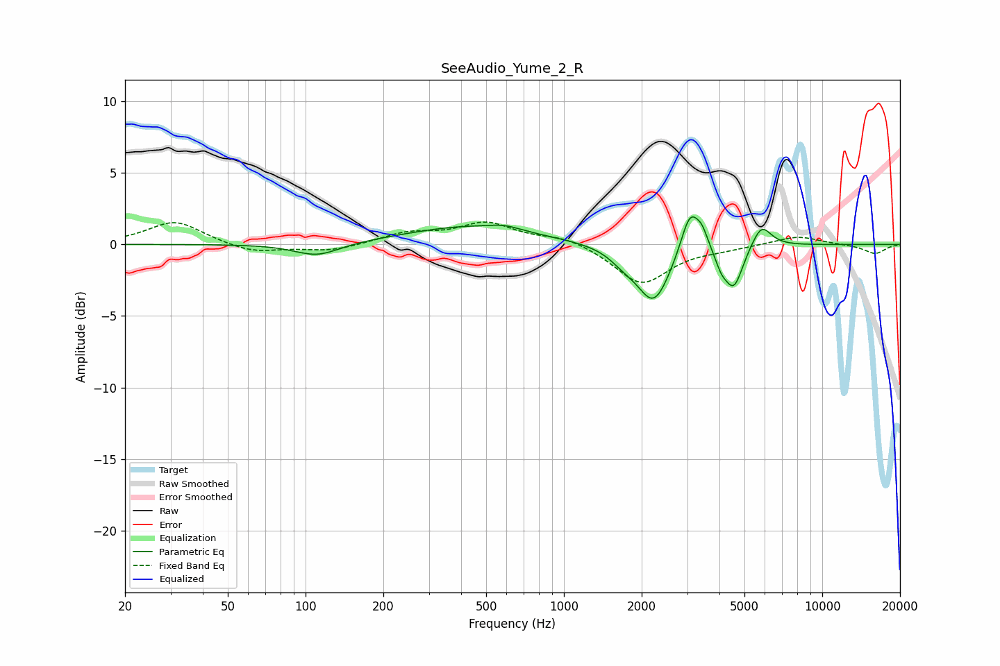

# SeeAudio_Yume_2_R
See [usage instructions](https://github.com/jaakkopasanen/AutoEq#usage) for more options and info.

### Parametric EQs
Apply preamp of -2.0 dB when using parametric equalizer.

|   # | Type    |   Fc (Hz) |    Q |   Gain (dB) |
|-----|---------|-----------|------|-------------|
|   1 | Peaking |       111 | 1.6  |        -0.9 |
|   2 | Peaking |       432 | 0.57 |         1.2 |
|   3 | Peaking |       591 | 2.38 |         0.3 |
|   4 | Peaking |      1702 | 2.69 |        -0.7 |
|   5 | Peaking |      2229 | 2.21 |        -4   |
|   6 | Peaking |      3080 | 3.96 |         3   |
|   7 | Peaking |      3427 | 5.99 |         1   |
|   8 | Peaking |      4062 | 6    |        -0.9 |
|   9 | Peaking |      4545 | 3.91 |        -2.9 |
|  10 | Peaking |      5816 | 3.67 |         1.6 |

### Fixed Band EQs
When using fixed band (also called graphic) equalizer, apply preamp of **-1.7 dB** (if available) and set gains manually with these parameters.

|   # | Type    |   Fc (Hz) |    Q |   Gain (dB) |
|-----|---------|-----------|------|-------------|
|   1 | Peaking |        31 | 1.41 |         1.6 |
|   2 | Peaking |        62 | 1.41 |        -0.6 |
|   3 | Peaking |       125 | 1.41 |        -0.5 |
|   4 | Peaking |       250 | 1.41 |         0.7 |
|   5 | Peaking |       500 | 1.41 |         1.4 |
|   6 | Peaking |      1000 | 1.41 |         0.6 |
|   7 | Peaking |      2000 | 1.41 |        -2.8 |
|   8 | Peaking |      4000 | 1.41 |        -0.2 |
|   9 | Peaking |      8000 | 1.41 |         0.6 |
|  10 | Peaking |     16000 | 1.41 |        -0.7 |

### Graphs

