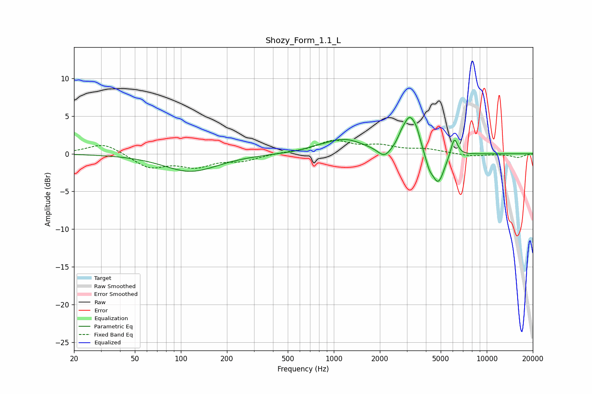

# Shozy_Form_1.1_L
See [usage instructions](https://github.com/jaakkopasanen/AutoEq#usage) for more options and info.

### Parametric EQs
Apply preamp of -4.9 dB when using parametric equalizer.

|   # | Type    |   Fc (Hz) |    Q |   Gain (dB) |
|-----|---------|-----------|------|-------------|
|   1 | Peaking |       116 | 0.8  |        -2.3 |
|   2 | Peaking |       749 | 2.35 |         0.2 |
|   3 | Peaking |      1162 | 1.09 |         1.9 |
|   4 | Peaking |      2142 | 3.35 |        -1.3 |
|   5 | Peaking |      2760 | 6    |         0.7 |
|   6 | Peaking |      3130 | 3.25 |         4.6 |
|   7 | Peaking |      3488 | 6    |         1.2 |
|   8 | Peaking |      4206 | 6    |        -1.3 |
|   9 | Peaking |      4810 | 3.37 |        -4.2 |
|  10 | Peaking |      6134 | 6    |         2.6 |

### Fixed Band EQs
When using fixed band (also called graphic) equalizer, apply preamp of **-1.9 dB** (if available) and set gains manually with these parameters.

|   # | Type    |   Fc (Hz) |    Q |   Gain (dB) |
|-----|---------|-----------|------|-------------|
|   1 | Peaking |        31 | 1.41 |         1.5 |
|   2 | Peaking |        62 | 1.41 |        -1.8 |
|   3 | Peaking |       125 | 1.41 |        -1.5 |
|   4 | Peaking |       250 | 1.41 |        -0.8 |
|   5 | Peaking |       500 | 1.41 |         0.1 |
|   6 | Peaking |      1000 | 1.41 |         1.6 |
|   7 | Peaking |      2000 | 1.41 |         0.9 |
|   8 | Peaking |      4000 | 1.41 |         0.5 |
|   9 | Peaking |      8000 | 1.41 |        -0.3 |
|  10 | Peaking |     16000 | 1.41 |        -0.5 |

### Graphs

