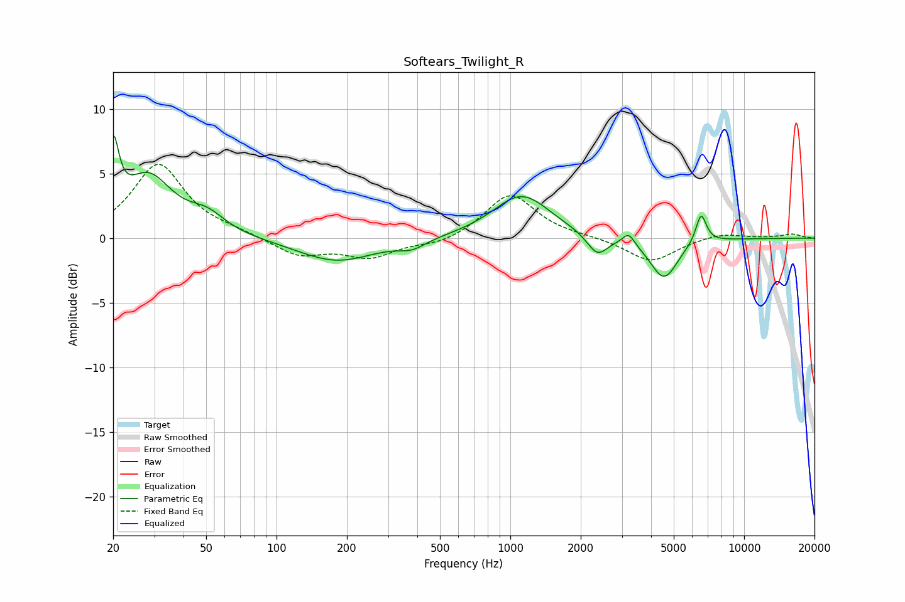

# Softears_Twilight_R
See [usage instructions](https://github.com/jaakkopasanen/AutoEq#usage) for more options and info.

### Parametric EQs
Apply preamp of -8.0 dB when using parametric equalizer.

|   # | Type    |   Fc (Hz) |    Q |   Gain (dB) |
|-----|---------|-----------|------|-------------|
|   1 | Peaking |        20 | 6    |         5.5 |
|   2 | Peaking |        28 | 1.37 |         4.6 |
|   3 | Peaking |        50 | 1.8  |         1.3 |
|   4 | Peaking |       180 | 0.85 |        -1.8 |
|   5 | Peaking |       380 | 2.47 |        -0.6 |
|   6 | Peaking |      1118 | 1.15 |         3.4 |
|   7 | Peaking |      2356 | 3.18 |        -1.6 |
|   8 | Peaking |      3207 | 5.52 |         0.9 |
|   9 | Peaking |      4542 | 2.36 |        -3.2 |
|  10 | Peaking |      6545 | 6    |         2.3 |

### Fixed Band EQs
When using fixed band (also called graphic) equalizer, apply preamp of **-5.8 dB** (if available) and set gains manually with these parameters.

|   # | Type    |   Fc (Hz) |    Q |   Gain (dB) |
|-----|---------|-----------|------|-------------|
|   1 | Peaking |        31 | 1.41 |         5.7 |
|   2 | Peaking |        62 | 1.41 |         0.4 |
|   3 | Peaking |       125 | 1.41 |        -1.4 |
|   4 | Peaking |       250 | 1.41 |        -1.4 |
|   5 | Peaking |       500 | 1.41 |        -0.5 |
|   6 | Peaking |      1000 | 1.41 |         3.5 |
|   7 | Peaking |      2000 | 1.41 |         0.1 |
|   8 | Peaking |      4000 | 1.41 |        -1.9 |
|   9 | Peaking |      8000 | 1.41 |         0.4 |
|  10 | Peaking |     16000 | 1.41 |         0.3 |

### Graphs

