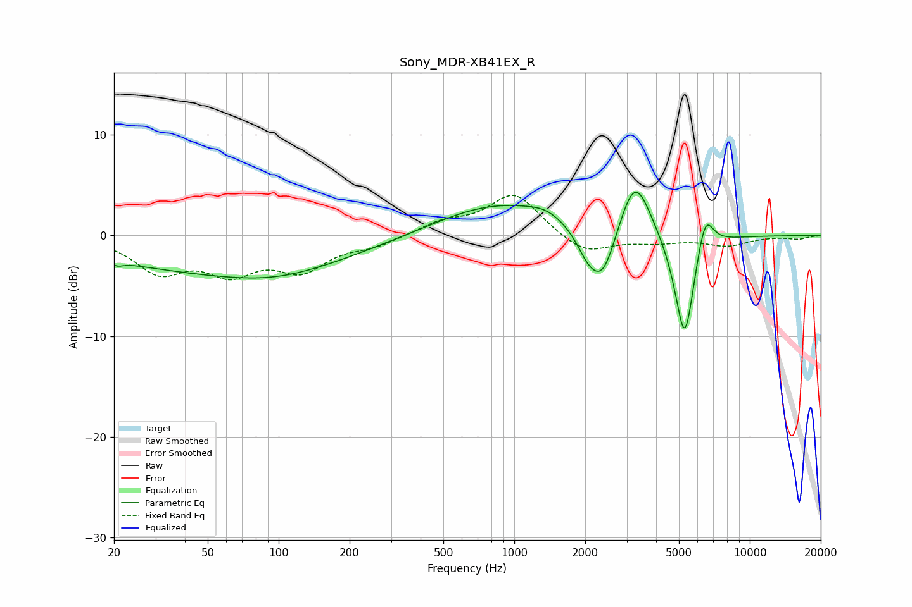

# Sony_MDR-XB41EX_R
See [usage instructions](https://github.com/jaakkopasanen/AutoEq#usage) for more options and info.

### Parametric EQs
Apply preamp of -4.4 dB when using parametric equalizer.

|   # | Type    |   Fc (Hz) |    Q |   Gain (dB) |
|-----|---------|-----------|------|-------------|
|   1 | Peaking |        21 | 5.73 |        -0.5 |
|   2 | Peaking |        60 | 0.25 |        -3.5 |
|   3 | Peaking |        95 | 0.67 |        -0.9 |
|   4 | Peaking |       856 | 0.54 |         3.2 |
|   5 | Peaking |      1360 | 1.91 |         0.7 |
|   6 | Peaking |      2065 | 2.66 |        -2.4 |
|   7 | Peaking |      2394 | 2.48 |        -4.9 |
|   8 | Peaking |      3255 | 2.08 |         6.3 |
|   9 | Peaking |      5287 | 3.18 |       -11.3 |
|  10 | Peaking |      6451 | 3.85 |         4.1 |

### Fixed Band EQs
When using fixed band (also called graphic) equalizer, apply preamp of **-4.1 dB** (if available) and set gains manually with these parameters.

|   # | Type    |   Fc (Hz) |    Q |   Gain (dB) |
|-----|---------|-----------|------|-------------|
|   1 | Peaking |        31 | 1.41 |        -3.4 |
|   2 | Peaking |        62 | 1.41 |        -3.2 |
|   3 | Peaking |       125 | 1.41 |        -3.1 |
|   4 | Peaking |       250 | 1.41 |        -0.9 |
|   5 | Peaking |       500 | 1.41 |         1.2 |
|   6 | Peaking |      1000 | 1.41 |         4.2 |
|   7 | Peaking |      2000 | 1.41 |        -1.9 |
|   8 | Peaking |      4000 | 1.41 |        -0.6 |
|   9 | Peaking |      8000 | 1.41 |        -0.9 |
|  10 | Peaking |     16000 | 1.41 |        -0.3 |

### Graphs

