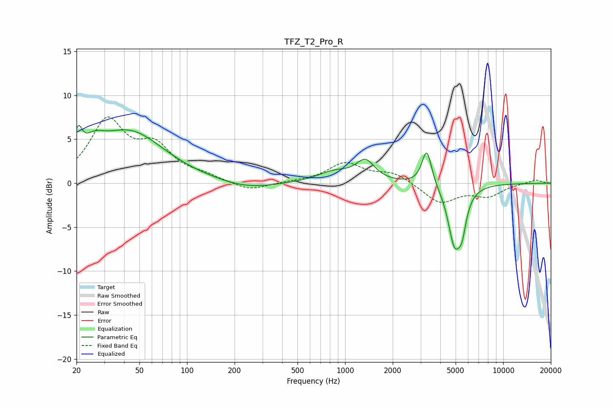

# TFZ_T2_Pro_R
See [usage instructions](https://github.com/jaakkopasanen/AutoEq#usage) for more options and info.

### Parametric EQs
Apply preamp of -6.7 dB when using parametric equalizer.

|   # | Type    |   Fc (Hz) |    Q |   Gain (dB) |
|-----|---------|-----------|------|-------------|
|   1 | Peaking |        20 | 5.85 |         2.9 |
|   2 | Peaking |        26 | 2.09 |         1.8 |
|   3 | Peaking |        43 | 0.64 |         5.7 |
|   4 | Peaking |       240 | 0.85 |        -0.8 |
|   5 | Peaking |       855 | 1.31 |         1.2 |
|   6 | Peaking |      1345 | 2.44 |         2.3 |
|   7 | Peaking |      3286 | 4.66 |         4.1 |
|   8 | Peaking |      4917 | 3.38 |        -6.3 |
|   9 | Peaking |      5463 | 3.69 |        -1.2 |
|  10 | Peaking |      5494 | 5.99 |        -1.9 |

### Fixed Band EQs
When using fixed band (also called graphic) equalizer, apply preamp of **-7.6 dB** (if available) and set gains manually with these parameters.

|   # | Type    |   Fc (Hz) |    Q |   Gain (dB) |
|-----|---------|-----------|------|-------------|
|   1 | Peaking |        31 | 1.41 |         6.8 |
|   2 | Peaking |        62 | 1.41 |         3.6 |
|   3 | Peaking |       125 | 1.41 |         0.6 |
|   4 | Peaking |       250 | 1.41 |        -0.9 |
|   5 | Peaking |       500 | 1.41 |         0.1 |
|   6 | Peaking |      1000 | 1.41 |         2.2 |
|   7 | Peaking |      2000 | 1.41 |         1.2 |
|   8 | Peaking |      4000 | 1.41 |        -2.2 |
|   9 | Peaking |      8000 | 1.41 |        -1.3 |
|  10 | Peaking |     16000 | 1.41 |         0.4 |

### Graphs

